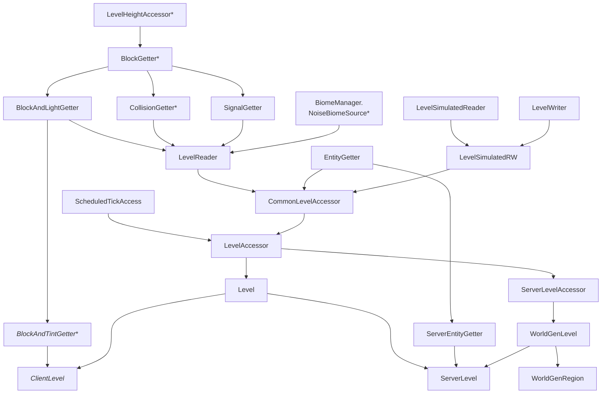

# Levels & Worlds

**Levels** or **dimensions** are parallel "world layers" within a Minecraft **world** (or **save**), each with their own 3D space and usually characterized by certain world generation elements. In vanilla Minecraft, each world consists of three dimensions: the Overworld, the Nether and the End.

A world can therefore be thought of as a collection of levels, plus some additional metadata (such as the name, the icon, the creation date etc.) Each level then holds the [block states][blockstate], [block entities][blockentity] and lots of other data in **chunks**. Chunks are partitions of the world, sized 16x16 blocks horizontally and spanning the entire world height vertically. In some situations, they are also partitioned vertically into cubes of 16x16x16, called **chunk sections** (or just sections for short).

Each of these systems lives in a relatively complex class hierarchy. This is owed to the fact that at different stages of loading a level, different subsystems are available or not yet available (for example, blocks and entities are loaded at completely different times). This makes the systems very hard to digest, so the purpose of this article is to provide an overview of the various classes and interfaces involved.

## Hierarchy of `Level`

Let's start with `Level`, which has the most complex class hierarchy of them all (interfaces in green, `abstract` classes in yellow, non-`abstract` classes in blue, [client-only][sides] classes or interfaces in _italics_, elements marked with \* have uses outside this hierarchy):



In order to digest this, let's go through each class separately, from loosely top to bottom:

### `LevelHeightAccessor`

Sits at the root of the hierarchy of block-related interfaces. It has two vital methods: `int getHeight()` and `int getMinY()`, both of which should be self-explanatory. Additionally, it offers various related helpers in default methods, such as `int getMaxY()` and `boolean isInsideBuildHeight()`.

`LevelHeightAccessor` is separated into an extra interface to allow querying heights without a whole new level or even `BlockGetter` being created. Minecraft creates new `LevelHeightAccessor`s in three places outside regular `Level`s, all in anonymous instances:

1. In `BlendingData`, used for the biome blending effect, held in the private final `areaWithOldGeneration` field.
2. In `LevelLightEngine`, used for lighting calculations, held in the protected final `levelHeightAccessor` field.
3. In `BelowZeroRetrogen`, used for deepslate generation in old worlds, held in the public static final `UPGRADE_HEIGHT_ACCESSOR` field.

### `BlockGetter`

Declares three methods crucial to many level operations: [`getBlockState(BlockPos)`][blockstate], `getFluidState(BlockPos)` and [`getBlockEntity(BlockPos)`][blockentity]. Additionally, it defines helper operations for clipping (a.k.a. raycasting) via `clip()` and related methods.

Outside of its immediate relevancy for levels, `BlockGetter` is also implemented by `LightChunk`, making it and [`BiomeManager.NoiseBiomeSource`][noisebiomesource] the common ancestors of `Level` and `LevelChunk`.

If for some reason you need a placeholder `BlockGetter` in your code, you can find one at `EmptyBlockGetter.INSTANCE`.

### `BlockAndLightGetter`

An extension of `BlockGetter` that provides access to a `LevelLightEngine` via `getLightEngine()`, as well as three helpers `getBrightness()`, `getRawBrightness()` and `canSeeSky()`.

### `CollisionGetter`

An extension of `BlockGetter` that provides a range of methods related to collision, including but not limited to:

- `getWorldBorder()` returns the active `WorldBorder`.
- `getChunkForCollisions()` returns the `BlockGetter` (always a `ChunkAccess` in practice) to use for collision checks.
- `getBlockCollisions()` and `getEntityCollisions()` each return an `Iterable<VoxelShape>` to use for checking collisions for blocks or entities, respectively.
- `getCollisions()` returns a concatenated `Iterable<VoxelShape>` of the results of both `getBlockCollisions()` and `getEntityCollisions()`.
- `noCollision()` returns `true` or `false` depending on whether the given parameters collide with neither a block nor an entity nor the world border.
- `isUnobstructed()` returns `true` or `false` depending on whether the given parameters obstruct block placement.

Besides `LevelReader`, `CollisionGetter` is also implemented by `PathNavigationRegion`, a class used in [entity][entity] navigation; this is the reason for its separation from `LevelReader`.

### `SignalGetter`

Provides various helper methods related to redstone signals, such as `hasSignal()`, `hasNeighborSignal()`, `getSignal()` or `getDirectSignal()`.

It is not implemented by anything else, and only ever encountered in the context of a `LevelReader`. Presumably, the redstone stuff was moved out of `LevelReader` for readability and/or legacy purposes.

### `BiomeManager.NoiseBiomeSource`

Defines a single method `getNoiseBiome()`, returning the `Biome` at the given position.

Also implemented by `ChunkAccess`, making it and [`BlockGetter`][blockgetter] the common ancestors of `Level` and `LevelChunk`, and additionally has a direct implementation in `FixedBiomeSource`, a class used for single biome worlds.

### `LevelReader`

`LevelReader` is the biggest interface in this hierarchy, together with `LevelAccessor`. It defines a ton of methods, with many of them relating to chunk or biome management, such as the following:

- `getChunk()`: Returns the chunk at the given position.
- `hasChunk()`: Returns whether a chunk exists at the given position. **Note:** This method is deprecated.
- `getHeight()`: Returns the surface height according to the given heightmap type at the given position.
- `getHeightmapPos()` Returns the given `BlockPos`, with the Y coordinate set to the local height as returned by `getHeight()`.
- `getSeaLevel()`: Returns the height at which oceans should generate.
- `getBiomeManager()`: Returns the level's `BiomeManager` instance.
- `getBiome()`: Returns the `Biome` at the given position.
- `getSkyDarken()`: Returns the sky darkness value. This is then used in various helpers, such as `getEffectiveSkyBrightness()` or `getMaxLocalRawBrightness()`, as well as in the phantom spawning mechanism.
- `dimensionType()`: Returns the level's `DimensionType`, i.e., the in-code representation of the level's JSON file.
- `getMinY()` and `getHeight()`: Overridden to use the values from `dimensionType()`.
- `isClientSide()`: Returns true or false depending on if this is a `ClientLevel` or not. Used all across the codebase for [side checks][sides].
- `registryAccess()`: Returns the level's `RegistryAccess`, which holds the level's [datapack registries][dpregistries].
- `enabledFeatures()`: Returns the level's active [`FeatureFlagSet`][featureflags].
- `environmentAttributes()`: Returns the level's `EnvironmentAttributeReader`.

### `EntityGetter`

`EntityGetter` is the interface for everything [`Entity`][entity]-related in a level. It defines the following methods:

- `getEntities()`: Returns all entities within a given `AABB`.
- `getEntitiesOfClass()`: Like `getEntities()` with an additional `Class<?>` check.
- `players()`: Returns all [players][player] in the level.
- `isUnobstructed()` and `getEntityCollisions()`: Entity-aware variants of their siblings in `CollisionGetter`.
- `getNearestPlayer()`, `hasNearbyAlivePlayer()` and `getPlayer()`: Self-explanatory.

It is only ever used within the level hierarchy, and not implemented anywhere else.

### `ServerEntityGetter`

A specialization of `EntityGetter` adding a few helpers, such as `getNearbyEntities()`, `getNearbyPlayers()`, `getNearestEntity()`, and appropriate overrides of `getNearestPlayer()`.

Like `EntityGetter`, this class is only used in the level hierarchy, specifically by `ServerLevel`.

### `LevelSimulatedReader`

Largely a legacy leftover, not used outside the level hierarchy, defining four methods:

- `isStateAtPosition()`: Whether the `BlockState` at the given `BlockPos` matches the given `Predicate<BlockState>`.
- `isFluidAtPosition()`: Like `isStateAtPosition()` but for `FluidState`s.
- `getBlockEntity()`: Same as `BlockGetter#getBlockEntity()`.
- `getHeightmapPos()`: Same as `LevelReader#getHeightmapPos()`.

### `LevelWriter`

Defines various writing operations on the level, such as [`setBlock()`][setblock], `removeBlock()` (which just sets the block to air/the fluid at the given `BlockPos`), `destroyBlock()` (which properly destroys the block with particles, drops etc.) and [`addFreshEntity()`][addfreshentity].

### `LevelSimulatedRW`

Literally just the following:

```java
public interface LevelSimulatedRW extends LevelSimulatedReader, LevelWriter {
}
```

No uses outside the `implements` clause of `CommonLevelAccessor`, either.

### `CommonLevelAccessor`

Ties together the `LevelReader`, `EntityGetter` and `LevelSimulatedRW` into a single interface that, again, is only ever used in its direct subinterface's `implements` clause. It overrides four methods:

- `getEntityCollisions()`: Defined in both `CollisionGetter` and `EntityGetter`, forwarded to `EntityGetter`.
- `isUnobstructed()`: Defined in both `CollisionGetter` and `EntityGetter`, forwarded to `EntityGetter`.
- `getBlockEntity()`: Defined in both `BlockGetter` and `LevelSimulatedReader`, forwarded to `BlockGetter`.
- `getHeightmapPos()`: Defined in both `LevelReader` and `LevelSimulatedReader`, forwarded to `LevelReader`.

### `ScheduledTickAccess`

TODO

### `LevelAccessor`

TODO

### `ServerLevelAccessor`

TODO

### `Level`

TODO

### `BlockAndTintGetter`

:::warning
This is a [client-only interface][sides]. Attempting to classload it on the server will crash with a `ClassNotFoundException`.
:::

TODO

### `ClientLevel`

:::warning
This is a [client-only class][sides]. Attempting to classload it on the server will crash with a `ClassNotFoundException`.
:::

TODO

### `WorldGenLevel`

TODO

### `WorldGenRegion`

TODO

### `ServerLevel`

TODO

## Hierarchy of `LevelChunk`

TODO

### `BlockGetter`

_See [Hierarchy of `Level`/`BlockGetter`][blockgetter]._

### `BiomeManager.NoiseBiomeSource`

_See [Hierarchy of `Level`/`BiomeManager.NoiseBiomeSource`][noisebiomesource]._

## See Also

- [Chunk][mcwikichunk] on the [Minecraft Wiki][mcwiki]
- [Dimension][mcwikidimension] on the [Minecraft Wiki][mcwiki]
- [World][mcwikiworld] on the [Minecraft Wiki][mcwiki]

[addfreshentity]: ../entities/index.md#spawning-entities
[blockentity]: ../blockentities/index.md
[blockgetter]: #blockgetter
[blockstate]: ../blocks/states.md
[dpregistries]: ../concepts/registries.md#datapack-registries
[entity]: ../entities/index.md
[featureflags]: ../advanced/featureflags.md
[mcwiki]: https://minecraft.wiki/
[mcwikichunk]: https://minecraft.wiki/w/Chunk
[mcwikidimension]: https://minecraft.wiki/w/Dimension
[mcwikiworld]: https://minecraft.wiki/w/World
[noisebiomesource]: #biomemanagernoisebiomesource
[player]: ../entities/livingentity.md#living-entities-mobs--players
[setblock]: ../blocks/states.md#levelsetblock
[sides]: ../concepts/sides.md
