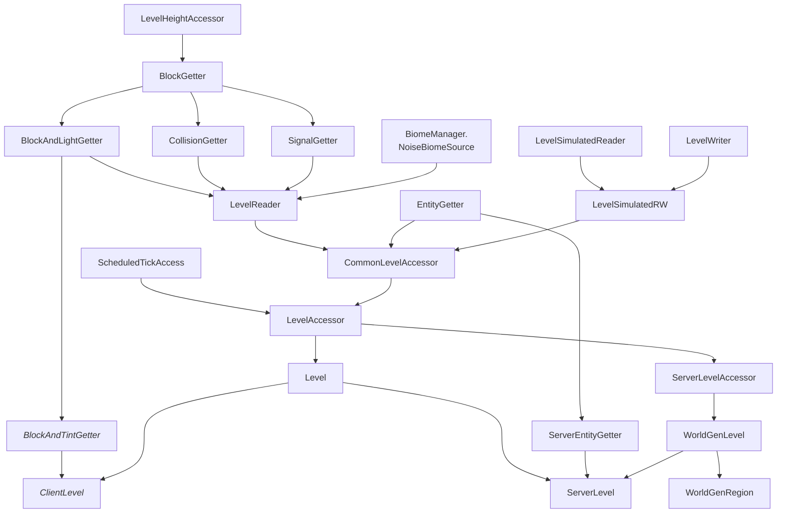

# Levels & Worlds

**Levels** or **dimensions** are parallel "worlds" within a Minecraft **world** (or **save**), each with their own 3D space and usually characterized by certain world generation elements. In vanilla Minecraft, each world consists of three dimensions: the Overworld, the Nether and the End.

A world can therefore be thought of as a collection of levels, plus some additional metadata (such as the name, the icon, the creation date etc.) Each level then holds the [block states][blockstate], [entities][entity], [block entities][blockentity] and lots of other data in **chunks**. Chunks are partitions of the world, sized 16x16 blocks horizontally and spanning the entire world height vertically. In some situations, they are also partitioned vertically into cubes of 16x16x16, called **chunk sections** (or just sections for short).

Each of these systems lives in a relatively complex class hierarchy. This is owed to the fact that at different stages of loading a level, different subsystems are available or not yet available (for example, blocks and entities are loaded at completely different times). This makes the systems very hard to digest, so the purpose of this article is to provide an overview of the various classes and interfaces involved.

## Hierarchy of `Level`

Let's start with `Level`, which has the most complex class hierarchy of them all (interfaces in green, `abstract` classes in red, non-`abstract` classes in blue, [client-only][sides] classes or interfaces in _italics_):

## See Also

- [Dimension][mcwikidimension] on the [Minecraft Wiki][mcwiki]
- [World][mcwikiworld] on the [Minecraft Wiki][mcwiki]

[blockentity]: ../blockentities/index.md
[blockstate]: ../blocks/states.md
[entity]: ../entities/index.md
[mcwiki]: https://minecraft.wiki/
[mcwikidimension]: https://minecraft.wiki/w/Dimension
[mcwikiworld]: https://minecraft.wiki/w/World
[sides]: ../concepts/sides.md
