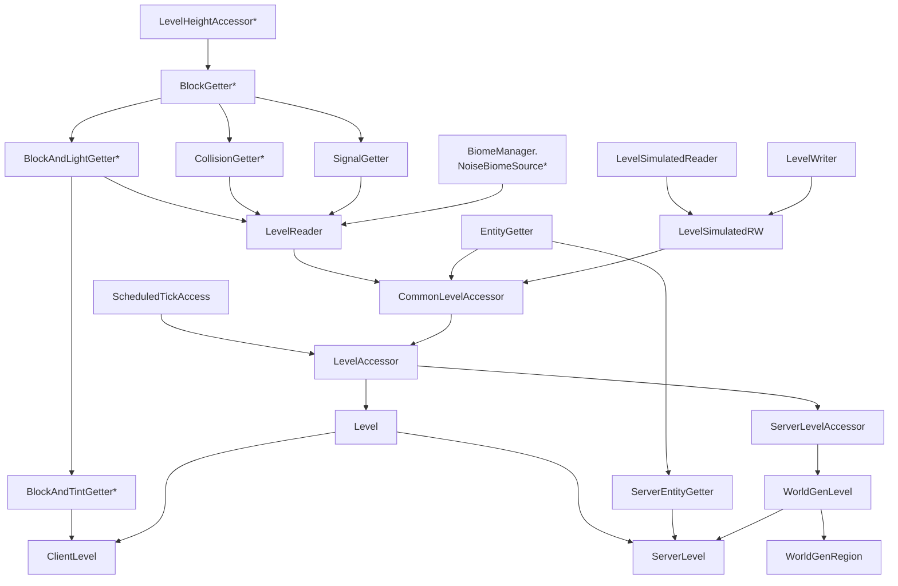
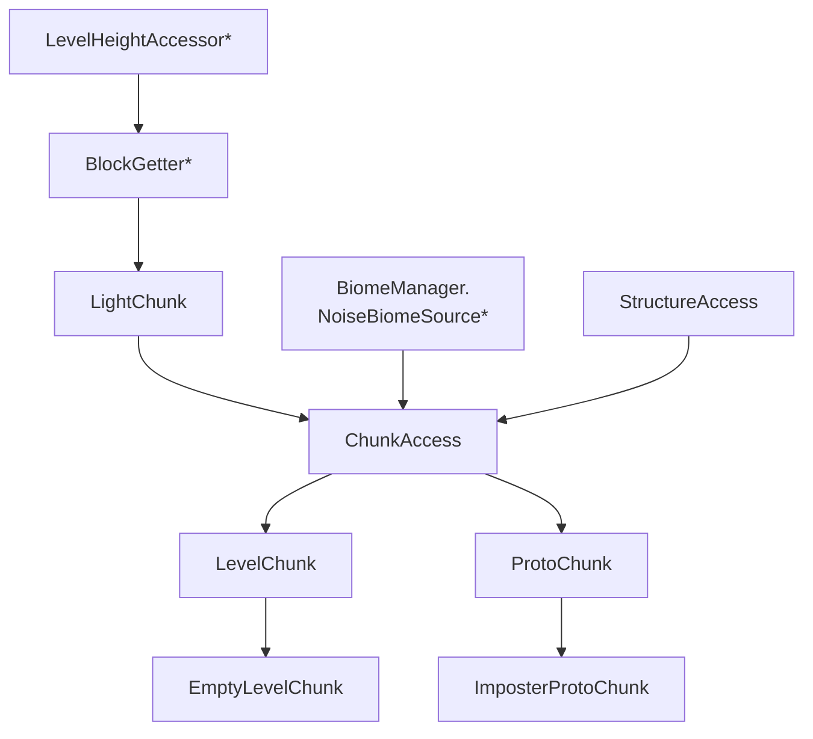

# Levels, Worlds & Servers

**Levels** are parallel "world layers" within a Minecraft **world** (or **save**), each with their own 3D space and usually characterized by certain world generation elements. In vanilla Minecraft, each world consists of three levels: the Overworld, the Nether and the End. To players, levels are often called **dimensions**, while in modding, dimensions refer to a related but distinct concept used in world generation.

A world can therefore be thought of as a collection of levels, plus some additional metadata (such as the name, the icon, the creation date etc.) Each level then holds the [block states][blockstate], [block entities][blockentity] and lots of other data in **chunks**. Chunks are partitions of the world, sized 16x16 blocks horizontally and spanning the entire world height vertically. In some situations, they are also partitioned vertically into cubes of 16x16x16, called **chunk sections** (or just sections for short).

When a client creates a new world or joins an existing world, it internally spins up a pseudo-server called the **integrated server**, so that the `ClientLevel` and `ServerLevel` separation is kept intact. In multiplayer, this does not happen; instead, the client connects to a **dedicated server** that is a completely different computer process (and in most cases hosted on a different computer). A server is represented in code by the abstract [`MinecraftServer`][server] class, in the form of an `IntegratedServer` or a `DedicatedServer`, respectively. See also the article on [Sides][sides] for this.

Both levels and chunks each live in a relatively complex class hierarchy. This is owed to the fact that at different stages of loading a level, different subsystems are available or not yet available (for example, blocks and entities are loaded at completely different times). This makes the systems very hard to digest, so the purpose of this article is to provide an overview of the various classes and interfaces involved.

## Overview

Without getting too much into the internals yet, there's a few classes to look out for:

- `Level`: Probably the most prominent class described on this page. Basically level code that runs on both logical sides will have an associated `Level`.
- `ClientLevel` and `ServerLevel`: The client-side and server-side level implementations.
- `WorldGenRegion`: Created on demand by `ServerLevel` to parallelize world generation. Has a reference to its owning `ServerLevel` and lives in the greater level hierarchy, but is **not `instanceof Level`**.
- `ChunkAccess`: The abstract class for chunk operations. Everything in the chunk hierarchy eventually runs through this class.
- `LevelChunk` and `EmptyLevelChunk`: The main class for chunks during regular gameplay, and an empty implementation for use during chunk loading.
- `ProtoChunk`: The `WorldGenRegion` equivalent of a `Level`/`ServerLevel`.
- `ImposterProtoChunk`: A `LevelChunk` wrapped as a `ProtoChunk`.

All of these classes have a complex superinterface hierarchy attached to them, which along with the classes themselves are described in more detail below.

## Obtaining a Level

In almost all contexts, a `Level` (or `ClientLevel`/`ServerLevel`) will be provided to you. Usually this happens as a parameter (e.g. `Level level`) or as a field in a context object (e.g. `event.getLevel()`). Entities have a `level()` method, and block entities have a `getLevel()` method - in both cases, be careful to not query that before the (block) entity is added to the level though, especially during level loading.

Sometimes, you will not get a `Level`, but one of its superinterfaces instead. In most (but not all!) contexts, it can be downcast to `Level`. To find out whether downcasting is possible or if the given object may also be a different class, check the level hierarchy below - if the interface has an asterisk (*) next to it, it is used elsewhere; if not, then you're good.

For good measure, it is recommended to not use a cast, but instead use an `instanceof` check with a pattern variable like so:

```java
LevelReader levelReader = ...;
if (levelReader instanceof Level level) {
    // ...
}
```

:::caution
By downcasting to `Level`, you lose potential `WorldGenRegion`s. This is not an issue in most contexts, but something to look out for if you are in a world generation context.
:::

Similarly, you can also check for a `ClientLevel` or `ServerLevel` when given a `Level` or any of its superinterfaces. Here, it is recommended to check [`Level#isClientSide()`][isclientside] first, and only do an `instanceof` check if access to `ClientLevel`/`ServerLevel`-specific fields or methods is really needed:

```java
Level level = ...;

// Client side
if (level.isClientSide()) {
    // some code here
}
if (level.isClientSide() && level instanceof ClientLevel clientLevel) {
    // some code that uses clientLevel here
}

// Server side
if (!level.isClientSide()) {
    // some code here
}
if (!level.isClientSide() && level instanceof ServerLevel serverLevel) {
    // some code that uses serverLevel here
}
```

If you find yourself without any level context at all, it is also possible to obtain a `Level` from the following places, depending on the side:

```java
// Client level. Is null when the player is not in a level, e.g. when on the main menu.
ClientLevel clientLevel = Minecraft.getInstance().level;

// Server level. Obtained from the MinecraftServer instance, see later in this article.
// Note that a MinecraftServer has multiple levels and we need to specify which one we want.
// `Level.OVERWORLD`, `Level.NETHER` and `Level.END` are available as level resource keys
// for the three vanilla levels. Other level resource keys can be created as needed.
ServerLevel serverLevel = ServerLifecycleHooks.getCurrentServer().getLevel(Level.OVERWORLD);
```

## Level Hierarchy

The level hierarchy, centered around the abstract `Level` class, has one of the most complex class hierarchies in the entire game:


```mermaid
graph TB
    LevelHeightAccessor["LevelHeightAccessor*"];
    BlockGetter["BlockGetter*"];
    BlockAndLightGetter["BlockAndLightGetter*"];
    BlockAndTintGetter["BlockAndTintGetter*"];
    CollisionGetter["CollisionGetter*"];
    NoiseBiomeSource["`BiomeManager.
    NoiseBiomeSource*`"];
    
    BlockAndLightGetter --> BlockAndTintGetter --> ClientLevel;
    LevelAccessor --> Level --> ClientLevel & ServerLevel;
    EntityGetter --> ServerEntityGetter --> ServerLevel;
    LevelAccessor --> ServerLevelAccessor --> WorldGenLevel --> ServerLevel & WorldGenRegion;
    Level ~~~ BlockAndTintGetter & ServerEntityGetter;
    ScheduledTickAccess & CommonLevelAccessor --> LevelAccessor;
    LevelReader & EntityGetter --> CommonLevelAccessor;
    LevelSimulatedReader & LevelWriter --> LevelSimulatedRW --> CommonLevelAccessor;
    LevelHeightAccessor --> BlockGetter --> BlockAndLightGetter & CollisionGetter & SignalGetter --> LevelReader;
    NoiseBiomeSource --> LevelReader;

    class WorldGenLevel,ServerLevelAccessor,LevelAccessor,CommonLevelAccessor,EntityGetter,ServerEntityGetter,BlockAndLightGetter,BlockAndTintGetter,ScheduledTickAccess,LevelSimulatedRW,LevelSimulatedReader,LevelWriter,LevelReader,NoiseBiomeSource,CollisionGetter,SignalGetter,BlockGetter,LevelHeightAccessor green;
    class Level yellow;
    class ClientLevel,ServerLevel,WorldGenRegion blue;
```

_<span class="mermaid-desc-green">Green</span> elements are interfaces, <span class="mermaid-desc-yellow">yellow</span> classes are `abstract`, <span class="mermaid-desc-blue">blue</span> classes are not `abstract`, elements marked with \* have uses outside this hierarchy._

In order to digest this diagram, let's go through each class separately, from loosely top to bottom:

### `LevelHeightAccessor`

Sits at the root of the hierarchy of block-related interfaces. It has two vital methods: `int getHeight()` and `int getMinY()`, both of which should be self-explanatory. Additionally, it offers various related helpers in default methods, such as `int getMaxY()` and `boolean isInsideBuildHeight()`.

`LevelHeightAccessor` is separated into an extra interface to allow querying heights without a whole new level or even `BlockGetter` being created. Minecraft creates new `LevelHeightAccessor`s in three places outside regular `Level`s, all in anonymous instances:

1. In `BlendingData`, used for the biome blending effect, held in the private final `areaWithOldGeneration` field.
2. In `LevelLightEngine`, used for lighting calculations, held in the protected final `levelHeightAccessor` field.
3. In `BelowZeroRetrogen`, used for deepslate generation in old worlds, held in the public static final `UPGRADE_HEIGHT_ACCESSOR` field.

### `BlockGetter`

Declares three methods crucial to many level operations: [`getBlockState(BlockPos)`][blockstate], `getFluidState(BlockPos)` and [`getBlockEntity(BlockPos)`][blockentity]. Additionally, it defines helper operations for clipping (a.k.a. raycasting) via `clip()` and related methods.

Outside its immediate relevancy for levels, `BlockGetter` is also implemented by `LightChunk`, making it and [`BiomeManager.NoiseBiomeSource`][noisebiomesource] the common ancestors of `Level` and `LevelChunk`.

If for some reason you need a placeholder `BlockGetter` in your code, you can find one at `EmptyBlockGetter.INSTANCE`.

### `BlockAndLightGetter`

An extension of `BlockGetter` that provides access to a `LevelLightEngine` via `getLightEngine()`, as well as three helpers `getBrightness()`, `getRawBrightness()` and `canSeeSky()`.

### `CollisionGetter`

An extension of `BlockGetter` that provides a range of methods related to collision, including but not limited to:

- `getWorldBorder()` returns the active `WorldBorder`.
- `getChunkForCollisions()` returns the `BlockGetter` (always a `ChunkAccess` in practice) to use for collision checks.
- `getBlockCollisions()` and `getEntityCollisions()` each return an `Iterable<VoxelShape>` to use for checking collisions for blocks or entities, respectively.
- `getCollisions()` returns a concatenated `Iterable<VoxelShape>` of the results of both `getBlockCollisions()` and `getEntityCollisions()`.
- `noCollision()` returns `true` or `false` depending on whether the given parameters collide with neither a block nor an entity nor the world border.
- `isUnobstructed()` returns `true` or `false` depending on whether the given parameters obstruct block placement.

Besides `LevelReader`, `CollisionGetter` is also implemented by `PathNavigationRegion`, a class used in [entity][entity] navigation; this is the reason for its separation from `LevelReader`.

### `SignalGetter`

Provides various helper methods related to redstone signals, such as `hasSignal()`, `hasNeighborSignal()`, `getSignal()` or `getDirectSignal()`.

It is not implemented by anything else, and only ever encountered in the context of a `LevelReader`. Presumably, the redstone stuff was moved out of `LevelReader` for readability and/or legacy purposes.

### `BiomeManager.NoiseBiomeSource`

Defines a single method `getNoiseBiome()`, returning the `Biome` at the given position.

Also implemented by `ChunkAccess`, making it and [`BlockGetter`][blockgetter] the common ancestors of `Level` and `LevelChunk`, and additionally has a direct implementation in `FixedBiomeSource`, a class used for single biome worlds.

### `LevelReader`

`LevelReader` is the biggest interface in this hierarchy, together with `LevelAccessor`. It defines a ton of methods, with many of them relating to chunk or biome management, such as the following:

- `getChunk()`: Returns the chunk at the given position.
- `hasChunk()`: Returns whether a chunk exists at the given position. **Note:** This method is deprecated.
- `getHeight()`: Returns the surface height according to the given heightmap type at the given position.
- `getHeightmapPos()` Returns the given `BlockPos`, with the Y coordinate set to the local height as returned by `getHeight()`.
- `getSeaLevel()`: Returns the height at which oceans should generate.
- `getBiomeManager()`: Returns the level's `BiomeManager` instance.
- `getBiome()`: Returns the `Biome` at the given position.
- `getSkyDarken()`: Returns the sky darkness value. This is then used in various helpers, such as `getEffectiveSkyBrightness()` or `getMaxLocalRawBrightness()`, as well as in the phantom spawning mechanism.
- `dimensionType()`: Returns the level's `DimensionType`, i.e., the in-code representation of the level's JSON file.
- `getMinY()` and `getHeight()`: Overridden to use the values from `dimensionType()`.
- `isClientSide()`: Returns true or false depending on if this is a `ClientLevel` or not. Used all across the codebase for [side checks][isclientside].
- `registryAccess()`: Returns the level's `RegistryAccess`, which holds the level's [datapack registries][dpregistries].
- `enabledFeatures()`: Returns the level's active [`FeatureFlagSet`][featureflags].
- `environmentAttributes()`: Returns the level's `EnvironmentAttributeReader`.

### `EntityGetter`

`EntityGetter` is the interface for everything [`Entity`][entity]-related in a level. It defines the following methods:

- `getEntities()`: Returns all entities within a given `AABB`.
- `getEntitiesOfClass()`: Like `getEntities()` with an additional `Class<?>` check.
- `players()`: Returns all [players][player] in the level.
- `isUnobstructed()` and `getEntityCollisions()`: Entity-aware variants of their siblings in `CollisionGetter`.
- `getNearestPlayer()`, `hasNearbyAlivePlayer()` and `getPlayer()`: Self-explanatory.

It is only ever used within the level hierarchy, and not implemented anywhere else.

### `ServerEntityGetter`

A specialization of `EntityGetter` adding a few helpers, such as `getNearbyEntities()`, `getNearbyPlayers()`, `getNearestEntity()`, and appropriate overrides of `getNearestPlayer()`.

Like `EntityGetter`, this class is only used in the level hierarchy, specifically by `ServerLevel`.

### `LevelSimulatedReader`

Largely a legacy leftover, not used outside the level hierarchy, defining four methods:

- `isStateAtPosition()`: Whether the `BlockState` at the given `BlockPos` matches the given `Predicate<BlockState>`.
- `isFluidAtPosition()`: Like `isStateAtPosition()` but for `FluidState`s.
- `getBlockEntity()`: Same as `BlockGetter#getBlockEntity()`.
- `getHeightmapPos()`: Same as `LevelReader#getHeightmapPos()`.

### `LevelWriter`

Defines various writing operations on the level, such as [`setBlock()`][setblock], `removeBlock()` (which just sets the block to air/the fluid at the given `BlockPos`), `destroyBlock()` (which properly destroys the block with particles, drops etc.) and [`addFreshEntity()`][addfreshentity].

### `LevelSimulatedRW`

Literally just the following:

```java
public interface LevelSimulatedRW extends LevelSimulatedReader, LevelWriter {
}
```

No uses outside the `implements` clause of `CommonLevelAccessor`, either.

### `CommonLevelAccessor`

Ties together the `LevelReader`, `EntityGetter` and `LevelSimulatedRW` into a single interface that, again, is only ever used in its direct subinterface's `implements` clause. It overrides four methods:

- `getEntityCollisions()`: Defined in both `CollisionGetter` and `EntityGetter`, forwarded to `EntityGetter`.
- `isUnobstructed()`: Defined in both `CollisionGetter` and `EntityGetter`, forwarded to `EntityGetter`.
- `getBlockEntity()`: Defined in both `BlockGetter` and `LevelSimulatedReader`, forwarded to `BlockGetter`.
- `getHeightmapPos()`: Defined in both `LevelReader` and `LevelSimulatedReader`, forwarded to `LevelReader`.

### `ScheduledTickAccess`

`ScheduledTickAccess` is an interface providing the following methods:

- `getBlockTicks()`: Returns a tick access interface for a level's or chunk's block tick scheduler.
- `getFluidTicks()`: Same as above, but for fluid ticks.
- `createTick(BlockPos pos, T type, int tickDelay)`: Schedules a tick at the given position for the given type after the given delay. `T` is the type of the associated `LevelTickAccess`, so `Block` or `Fluid` in the vanilla uses. Comes with an overload that additionally accepts a `TickPriority` parameter.
- `scheduleTick(BlockPos pos, Block type, int tickDelay)`: Helper method to schedule a block tick. Also comes in a fluid variant, and in variants that additionally accept a `TickPriority` parameter.

### `LevelAccessor`

Integrates certain other systems into the `Level` system. Methods include:

- `getLevelData()`: Access to the `LevelData`, which holds properties such as game time, hardcore and difficulty settings, and the world spawn (in the `LevelData.RespawnData` record).
- `getGameTime()` and `getDifficulty()`: Utility accessors for game time and difficulty, respectively, both of which query the `LevelData`.
- `getServer()`: Returns the `MinecraftServer` instance. `ClientLevel`s return `null` here, while `ServerLevel`s and `WorldGenRegion`s return non-`null`.
- `getRandom()`: Returns the level's `RandomSource`, used heavily in world generation and many other places.
- `getChunkSource()`: Returns the level's `ChunkSource`, which is responsible for loading and saving chunks.
- `hasChunk()`: Returns whether a chunk exists at the given x and z chunk coordinate.
- `updateNeighborsAt()`: No-op by default. Overridden in `ServerLevel` to send neighbor update notifications, used by the redstone system.
- `neighborShapeChanged()`: Notifies neighbors that the shape at the given position has changed. Used to propagate e.g. fence or wall updating their shapes.
- `playSound()`: See [Sounds/Playing Sounds][playsound].
- `addParticle()`: See [Particles/Spawning Particles][spawningparticles].
- `gameEvent()`: See [`GameEvent`s][gameevent]. Comes in various overloads.
- `levelEvent()`: See [`LevelEvent`s][levelevent]. Comes in various overloads.

### `ServerLevelAccessor`

Has three methods:

- `getLevel()`: Returns a `ServerLevel`. Overridden in `ServerLevel` to return `this`, and in `WorldGenRegion` to return the backing `ServerLevel`.
- `getCurrentDifficultyAt()`: Returns the local difficulty at the given position.
- `addFreshEntityWithPassengers()`: A utility method that [adds an entity][addfreshentity] and all its passengers. Used mainly in spawning of e.g. chicken jockeys or similar multi-entity spawns.

### `Level`

`Level` is the core class tying almost all interfaces together. All essential logic that is the same between client and server is concentrated here. Explaining all methods is way outside the scope of the article, but the most notable ones include:

- Implementations of tons of methods related to world storage, such as `getChunk()`, `getBlock`/`FluidState()`, `setBlock()`, `get`/`setBlockEntity()`, and many related methods.
- Adding, updating, querying, and removal of [entities][entity] and [block entities][blockentity] in the level.
- Various [datapack registry][dpregistries]-related accessors such as `dimension()`, `dimensionType()`, `registryAccess()`, `damageSources()`, `recipeAccess()`, `getBiomeManager()`, `potionBrewing()` and `fuelValues()`.
- Time and weather management methods. A lot of it is also split off into `ServerLevel`.
- The level random via `getRandom()`.
- Implementations and overloads of [`playSound()`][playsound] and other sound playing methods.
- Implementations and overloads of [`addParticle()`][spawningparticles] and other particle spawning methods.
- Various overloads of `explode()`.
- Various methods for world bounds checks, such as `isInWorldBounds()`.
- A few methods for spawn light checks, e.g. `isBrightOutside()` and `isDarkOutside()`.

`Level` additionally extends `AttachmentHolder`, meaning that it supports [data attachments][attachments].

### `BlockAndTintGetter`

:::warning
This is a [client-only interface][sides]. Attempting to classload it on the server will crash with a `ClassNotFoundException`.
:::

TODO

### `ClientLevel`

:::warning
This is a [client-only class][sides]. Attempting to classload it on the server will crash with a `ClassNotFoundException`.
:::

TODO

### `WorldGenLevel`

TODO

### `WorldGenRegion`

TODO

### `ServerLevel`

TODO

## Chunk Hierarchy

The hierarchy of chunks is considerably smaller than that of levels. The main quirks are its relation to `Level`s via `BlockGetter` and `BiomeManager.NoiseBiomeSource`, and the split into `LevelChunk`s and `ProtoChunk`s:


```mermaid
graph TB;
    LevelHeightAccessor["LevelHeightAccessor*"];
    BlockGetter["BlockGetter*"];
    NoiseBiomeSource["`BiomeManager.
    NoiseBiomeSource*`"];

    LevelHeightAccessor --> BlockGetter --> LightChunk --> ChunkAccess --> LevelChunk --> EmptyLevelChunk;
    NoiseBiomeSource & StructureAccess --> ChunkAccess --> ProtoChunk --> ImposterProtoChunk;

    class LevelHeightAccessor,BlockGetter,LightChunk,NoiseBiomeSource,StructureAccess green;
    class ChunkAccess yellow;
    class LevelChunk,EmptyLevelChunk,ProtoChunk,ImposterProtoChunk blue;
```

_<span class="mermaid-desc-green">Green</span> elements are interfaces, <span class="mermaid-desc-yellow">yellow</span> classes are `abstract`, <span class="mermaid-desc-blue">blue</span> classes are not `abstract`, elements marked with \* have uses outside this hierarchy._

Again, let's digest this loosely from top to bottom:

### `LevelHeightAccessor`

_See [Hierarchy of `Level`/`LevelHeightAccessor`][levelheightaccessor]._

### `BlockGetter`

_See [Hierarchy of `Level`/`BlockGetter`][blockgetter]._

### `BiomeManager.NoiseBiomeSource`

_See [Hierarchy of `Level`/`BiomeManager.NoiseBiomeSource`][noisebiomesource]._

### `LightChunk`

TODO

### `StructureAccess`

TODO

### `ChunkAccess`

TODO

`ChunkAccess` additionally implements `IAttachmentHolder`, meaning that it supports [data attachments][attachments].

### `LevelChunk`

TODO

### `EmptyLevelChunk`

TODO

### `ProtoChunk`

TODO

### `ImposterProtoChunk`

TODO

## `MinecraftServer`

TODO

## `GameEvent`s

TODO

## `LevelEvent`s

TODO

## See Also

- [Chunk][mcwikichunk] on the [Minecraft Wiki][mcwiki]
- [Dimension][mcwikidimension] on the [Minecraft Wiki][mcwiki]
- [World][mcwikiworld] on the [Minecraft Wiki][mcwiki]

[addfreshentity]: ../entities/index.md#spawning-entities
[attachments]: ../datastorage/attachments.md
[blockentity]: ../blockentities/index.md
[blockgetter]: #blockgetter
[blockstate]: ../blocks/states.md
[dpregistries]: ../concepts/registries.md#datapack-registries
[entity]: ../entities/index.md
[featureflags]: ../advanced/featureflags.md
[gameevent]: #gameevents
[isclientside]: ../concepts/sides.md#levelisclientside
[levelevent]: #levelevents
[levelheightaccessor]: #levelheightaccessor
[mcwiki]: https://minecraft.wiki/
[mcwikichunk]: https://minecraft.wiki/w/Chunk
[mcwikidimension]: https://minecraft.wiki/w/Dimension
[mcwikiworld]: https://minecraft.wiki/w/World
[noisebiomesource]: #biomemanagernoisebiomesource
[player]: ../entities/livingentity.md#living-entities-mobs--players
[playsound]: ../resources/client/sounds.md#playing-sounds
[server]: #minecraftserver
[setblock]: ../blocks/states.md#levelsetblock
[sides]: ../concepts/sides.md
[spawningparticles]: ../resources/client/particles.md#spawning-particles
