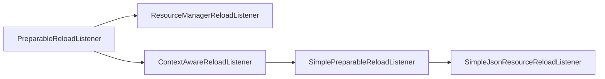

# Reload Listeners

In some situations, integrating with the [existing resource systems][resources] provided by Minecraft or NeoForge just isn't going to cut it. Instead, having your system load files by itself from a resource or data pack is more desirable. For this purpose, you can register a custom reload listener, implementing `PreparableReloadListener` or one of its subinterfaces/subclasses.

The idea behind a reload listener is simple: When a resource pack or data pack reload happens, the listener is called upon to read its contents from the new set of resource or data packs. It will then keep the contents until the next reload, at which point the contents will be discarded and the cycle starts anew.

:::tip
On the server [side][sides], the [datapack registry][datapackregistries] or [data map][datamaps] systems may be better suited for many use cases.
:::

## Reloading

Both resource pack and data pack reload function similar in principle and only differ in the associated physical and logical [side][sides], and by extension the timing and the location files are loaded from.

|                                              | Client Reload Listener                                                                                                             | Server Reload Listener                                                                                                |
|----------------------------------------------|------------------------------------------------------------------------------------------------------------------------------------|-----------------------------------------------------------------------------------------------------------------------|
| **Loads From**                               | Resource packs (`assets` folder)                                                                                                   | Data packs (`data` folder)                                                                                            |
| **First Reload**<br/>(Physical Client)       | - Startup                                                                                                                          | - Creating a new world<br/>("Preparing for world creation...")<br/>- Joining an existing world<br/>- Joining a server |
| **Subsequent Reloads**<br/>(Physical Client) | - Changing resource packs in the Options menu<br/>- Downloading a server's custom resource pack on server join<br/>- Pressing F3+T | - Leaving a world or server\*<br/>                                                                                    |
| **First Reload**<br/>(Physical Server)       | _never_                                                                                                                            | - Startup                                                                                                             |
| **Subsequent Reloads**<br/>(Physical Server) | _never_                                                                                                                            | - `/reload` command                                                                                                   |

\*When leaving a world, any stored data becomes stale. Depending on how your system is set up, **this can cause memory leaks**. See [Server-Side Reload Listeners][serverlisteners] below for what mechanisms to use to avoid memory leaks.

:::info
The `/reload` command also triggers reloads of some other datapack-driven systems, such as [tags][tags]. This is by design and cannot be circumvented.
:::

### Multi-Threaded Reloading

Conceptually, the work of a single reload listener can commonly be split into two stages:

- **Preparation**: The necessary files are collected, validated and parsed into some object that can be used in the next step. The preparation stage is run on **multiple threads**.
- **Application**: The object from the previous step is "applied" to the game, usually by means of setting some field or adding to some collection. The application stage is run on the **main thread**.

To ensure synchronization, after preparation, a `PreparationBarrier` is `wait`ed for by the underlying `CompletableFuture`. Only once all preparation threads have run, the application stage is allowed to run. In code, this looks roughly as follows:

```java
@Override
public CompletableFuture<Void> reload(
    SharedState currentReload,
    Executor taskExecutor,
    PreparationBarrier barrier,
    Executor reloadExecutor
) {
    return CompletableFuture
        .supplyAsync(() -> {
            // Collect and return the result of the preparation stage here.
        })
        .thenCompose(barrier::wait)
        .thenAcceptAsync(preparations -> {
            // Run the application stage.
            // `preparations` is the return value of the `supplyAsync` call above.
        });
}
```

See [`PreparableReloadListener`][preparablereloadlistener] below for an explanation of the parameters.

## Adding and Retrieving Reload Listeners

All reload listeners are registered using the same basic principle, though with some differences depending on the logical [side][sides]. First, we need a reload listener class. Then, we register it to the side-specific [event][events]. Finally, we can retrieve the reload listener in a side-specific way and operate on it.

### Client-Side Reload Listeners

On the client side, it is sufficient to hold the reload listener in a singleton instance, like so:

```java
// Instead of PreparableReloadListener, extend one of its subclasses if applicable, see below.
public class MyClientReloadListener implements PreparableReloadListener {
    // The id we're going to use in registration below
    public static final Identifier ID = Identifier.fromNamespaceAndPath("mymod", "my_client_listener");
    // The instance through which the listener is accessed
    public static final MyClientReloadListener INSTANCE = new MyClientReloadListener();

    // Hide the constructor in accordance with the singleton pattern
    private MyClientReloadListener() {
    }

    // other methods added here later
}
```

Next, we add the reload listener in the `AddClientReloadListenersEvent` like so:

```java
@SubscribeEvent // on the game event bus only on the physical client
public static void addClientReloadListeners(AddClientReloadListenersEvent event) {
    event.addListener(MyClientReloadListener.ID, MyClientReloadListener.INSTANCE);
}
```

And that's it! To access the reload listener, simply access the `MyClientReloadListener.INSTANCE` field.

### Server-Side Reload Listeners

On the server side, it is theoretically possible to follow the same singleton pattern as above, and just register to `AddServerReloadListenersEvent`. However, this poses a high risk of memory leaks at reloading time if not handled properly; furthermore, it can also lead to unintended "reaching across sides" in the form of client code accessing the server's reload listeners.

To combat this, NeoForge introduces the concept of retained listeners. Retained listener are accessed from a `MinecraftServer` instance (which can be retrieved from a `ServerLevel`) rather than a singleton instance, using a `ListenerKey<T>`.

The reload listener class itself looks fairly similar to a [client-side reload listener][clientlisteners], though replaces the singleton `INSTANCE` with a `LISTENER_KEY`:

```java
// Instead of PreparableReloadListener, extend one of its subclasses if applicable, see below.
public class MyServerReloadListener implements PreparableReloadListener {
    // The id we're going to use in registration below
    public static final Identifier ID = Identifier.fromNamespaceAndPath("mymod", "my_server_listener");
    // Create a listener key for use in the event
    public static final ListenerKey<MyServerReloadListener> LISTENER_KEY = ListenerKey.create(ID);

    // We now have a public constructor.
    public MyServerReloadListener() {
    }

    // other methods added here later
}
```

Next, we register a retained listener to the `AddServerReloadListenersEvent` like so:

```java
@SubscribeEvent // on the game event bus
public static void addServerReloadListeners(AddServerReloadListenersEvent event) {
    event.addRetainedListener(MyServerReloadListener.LISTENER_KEY, new MyServerReloadListener());
}
```

And finally, we can access the listener from a `ServerLevel` like so:

```java
MyServerReloadListener listener = serverLevel
        .getServer()
        .getServerResources()
        .managers()
        .getListener(MyServerReloadListener.LISTENER_KEY);
```

## Reload Listener Class Hierarchy



_Interfaces in green, abstract classes in blue._

### `PreparableReloadListener`

`PreparableReloadListener` sits at the top of the hierarchy, and is the type accepted by the events above. It defines a method `#reload()` that returns a `CompletableFuture<Void>` and accepts four parameters:

- `SharedState currentReload`: The [shared state][sharedstate] of the reload.
- `Executor taskExecutor`: An `Executor` for tasks that can run on multiple threads.
- `PreparationBarrier barrier`: A threading barrier object.
- `Executor reloadExecutor`: An `Executor` for tasks that need to run on the main thread.

Additionally, it defines two default methods:

- `prepareSharedState(SharedState currentReload)`: Does nothing by default. See [Shared Reloading State][sharedstate].
- `getName()`: Returns a name to use in logging. By default, returns the class name.

In a `PreparableReloadListener`, you can load basically anything. For example, this is directly implemented by many reload listeners that load binary data ([textures][textures], fonts, etc., but notably not [sounds][sounds]), as well as some others such as [data maps][datamaps]. However, many systems - for example many JSON-based systems - use one of the abstract classes below instead.

### `ContextAwareReloadListener`

`ContextAwareReloadListener` is a utility class that supplies a [data load condition][conditions] context, obtainable via `#getContext()`. Additionally, it provides a registry access via `#getRegistryLookup()`.

:::info
This class is added into the hierarchy by NeoForge, as data load conditions are a NeoForge system.
:::

### `SimplePreparableReloadListener`

`SimplePreparableReloadListener<T>` is an example implementation of a `PreparableReloadListener` that splits the preparation and application stages (see [Multi-Threaded Reloading][multithreading]) into two entirely separate methods. Instead of `#reload()`, you must now override `#prepare()` and `#apply()`. For example:

```java
// The generic type denotes the type of the object that is passed from #prepare() to #apply().
// For example, in many cases, this will be a List<MyObject>, Map<?, MyObject> or similar.
// This is often (but not necessarily) the same as the type of the stored data.
public class MyReloadListener extends SimplePreparableReloadListener<MyObject> {
    // We use the singleton pattern of client reload listeners here for the sake of example.
    // This part can be adjusted as needed if you're using a server reload listener.
    public static final Identifier ID = Identifier.fromNamespaceAndPath("mymod", "my_listener");
    public static final MyReloadListener INSTANCE = new MyReloadListener();
    private MyReloadListener() {}

    // A field to hold our object.
    private MyObject myObject;

    @Override    
    protected MyObject prepare(ResourceManager manager, ProfilerFiller profiler) {
        // Run whatever logic to collect, parse and validate the files.
        return new MyObject();
    }

    @Override
    protected void apply(MyObject preparations, ResourceManager manager, ProfilerFiller profiler) {
        // Set the field in our object to the prepared objects, for later use.
        this.myObject = preparations;
    }

    // Provide access to the values in whatever way you deem necessary. For example:
    public MyObject getMyObject() {
        return myObject;
    }
}
```

### `SimpleJsonResourceReloadListener`

`SimpleJsonResourceReloadListener<T>` is a further specialization of `SimplePreparableReloadListener` that loads and parses JSON files using a [`Codec`][codec]. It extends `SimplePreparableReloadListener<Map<Identifier, T>>`, meaning a map of filenames (represented as [identifiers][identifier]) to whatever type you want to parse your JSONs to.

The class also completely implements the preparation stage for you, in the manner that most JSON systems work: going through the resource packs top to bottom, and only retains the top-most entry for each filename. This means that to perform merging (similar to e.g. [tags][tags]) or other operations that involve all the files for each filename from different resource/data packs, you need to implement folder scanning yourself.

All that remains for you to do is store the `Map<Identifier, T>` in `#apply()`. The simplest implementation looks like this:

```java
public class MyReloadListener extends SimpleJsonResourceReloadListener<MyObject> {
    // As above.
    public static final Identifier ID = Identifier.fromNamespaceAndPath("mymod", "my_listener");
    public static final MyReloadListener INSTANCE = new MyReloadListener();
    // This map will store our values.
    private final Map<Identifier, MyObject> values = new HashMap<>();

    private MyReloadListener() {
        // Add a super call here. The parameters are the codec (assuming MyObject.CODEC to be a Codec<MyObject>)
        // and a FileToIdConverter, see the FileToIdConverter section below.
        super(MyObject.CODEC, FileToIdConverter.json("mymod/my_listener"));
    }

    @Override
    protected void apply(Map<Identifier, MyObject> preparations, ResourceManager resourceManager, ProfilerFiller profiler) {
        // Clear out the old values and add our new ones.
        values.clear();
        values.putAll(preparations);
    }

    // Provide access to the values in whatever way you deem necessary. For example:
    @Nullable
    public MyObject get(Identifier id) {
        return values.get(id);
    }

    public Map<Identifier, MyObject> getAll() {
        return Collections.unmodifiableMap(values);
    }
}
```

And then simply access your values like so (of course making sure that key actually exists):

```java
MyObject myObject = MyReloadListener.INSTANCE.get(Identifier.fromNamespaceAndPath("mymod", "example"));
```

#### `FileToIdConverter`

`FileToIdConverter` is a utility record used for converting filenames into [`Identifier`s][identifier]. It defines a namespace-local prefix and an extension, which are stripped away. According to these, the converter splits each file path into five parts:

- The `assets` or `data` directory
- The namespace, consisting of the next subdirectory's name
- The prefix of the `FileToIdConverter` (which may contain slashes, making it span multiple directory layers)
- The path of the file (which again may contain slashes to span multiple directory layers)
- The extension of the file.

It will then construct an `Identifier` from the namespace and the path of the file, i.e., the second and fourth part. For example, consider the following `FileToIdConverter`:

```java
FileToIdConverter converter = new FileToIdConverter("mymod/my_listener", ".json");
// Equivalent, automatically sets the .json extension:
FileToIdConverter converter = FileToIdConverter.json("mymod/my_listener");
```

The above converter will split the path `assets/mymod/mymod/my_listener/example_1.json` as follows:

- `assets`
- `mymod` is the namespace
- `mymod/my_listener` is the prefix of the `FileToIdConverter`
- `example_1` is the path
- `.json` is the extension of the `FileToIdConverter`

So the resulting `Identifier` will be `mymod:example_1`. Other examples:

- `assets/mymod/mymod/my_listener/subfolder/example_2.json` -> `mymod:subfolder/example_2`
- `assets/othermod/mymod/my_listener/example_3.json` -> `othermod:example_3`

Besides the constructor and the `FileToIdConverter#json()` helper, there is an additional helper `FileToIdConverter#registry()` that accepts a [`ResourceKey<? extends Registry<?>>`][resourcekey] and converts the registry key to a namespace-and-path string, like the ones above.

:::tip
In order to avoid conflicts where two mods add a registry that is named the same, it is strongly recommended to prefix your reload listener's folder with a folder named after the mod id, as seen above with `mymod/my_listener`. The `#registry()` helper does this for you automatically.
:::

### `ResourceManagerReloadListener`

`ResourceManagerReloadListener` is a special utility interface that runs once the reload itself has completed, providing the fully-populated `ResourceManager` in its only method `#onResourceManagerReload()`. Classes implementing this interface mainly do post-reload cleanup work, cache building or similar.

## Shared Reloading State

As mentioned before, reloading happens on multiple threads since reload listeners are generally unrelated to one another. If you need to access another reload listener's values, you must set a shared state. To do so, in your reload listener, override the default `prepareSharedState()` method:

```java
// Create a record (or class) holding our data to pass to another listener
public record MyPendingResources(/* any data here */) {}

// Can also extend/implement any subclass/subinterface of PreparableReloadListener
public class MyReloadListener implements PreparableReloadListener {
    // other stuff here

    // Create a StateKey with our record as the type
    public static final StateKey<MyPendingResources> STATE_KEY = new StateKey<>();
    
    // Override prepareSharedState() to add our pending resources
    @Override
    public void prepareSharedState(PreparableReloadListener.SharedState currentReload) {
        currentReload.set(STATE_KEY, new MyPendingResources(/* any data here */));
    }

    // Then, use in reload() like so:
    @Override
    public CompletableFuture<Void> reload(SharedState currentReload, Executor taskExecutor, PreparationBarrier barrier, Executor reloadExecutor) {
        MyPendingResources pending = currentReload.get(STATE_KEY);
        // do the reload here, using `pending`
    }
}
```

The reload system will then ensure for you that the pending resources are available in the reload.

[clientlisteners]: #client-side-reload-listeners
[codec]: ../datastorage/codecs.md
[conditions]: server/conditions.md
[datamaps]: server/datamaps/index.md
[datapackregistries]: ../concepts/registries.md#datapack-registries
[events]: ../concepts/events.md
[identifier]: ../misc/identifier.md
[multithreading]: #multi-threaded-reloading
[preparablereloadlistener]: #preparablereloadlistener
[recipes]: server/recipes/index.md
[resourcekey]: ../misc/identifier.md#resourcekeys
[resources]: index.md
[serverlisteners]: #server-side-reload-listeners
[sharedstate]: #shared-reloading-state
[sides]: ../concepts/sides.md
[sounds]: client/sounds.md
[tags]: server/tags.md
[textures]: client/textures.md
