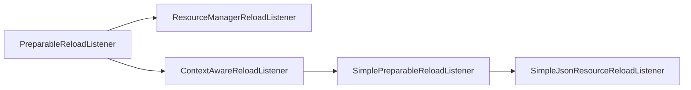

# Reload Listeners

In some situations, integrating with the [existing resource systems][resources] provided by Minecraft or NeoForge just isn't going to cut it. Instead, having your system load files by itself from a resource or data pack is more desirable. For this purpose, you can register a custom reload listener, implementing `PreparableReloadListener` or one of its subinterfaces/subclasses.

The idea behind a reload listener is simple: When a resource pack or data pack reload happens, the listener is called upon to read its contents from the new set of resource or data packs, loaded into a global `ResourceManager` and usually reference-copied into other places for easier access. It will then keep the contents until the next reload, at which point the contents will be discarded and the cycle starts anew.

## Reloading

Both resource pack and data pack reload function similar in principle and only differ in the associated [side][sides], and by extension the timing and the location files are loaded from.

Client reload listeners load from resource packs (the `assets` folder). The first reload happens during startup on the physical client, and **never** on the physical server. Subsequent reloads are triggered when resource packs are changed in the Options menu, or by pressing F3+T.

Server reload listeners load from data packs (the `data` folder). The first reload happens during world loading, which happens on world/server join on the physical client, and on startup on the physical server. Subsequent reloads are triggered using the `/reload` command, or by switching worlds/servers on the physical client.

:::info
The `/reload` command also triggers reloads of some other datapack-driven systems, such as [datapack registries][datapackregistries]; this is by design and cannot be circumvented. Datapack registries are reloaded before reload listeners, meaning you can use their values in your server-side reload listeners if needed.
:::

Reloading happens on multiple threads, as reload listeners are unrelated to one another. If you need to access another reload listener's values, consider delaying execution until the first use of your system after the reload has complete, or avoid access altogether.

## Adding a Reload Listener

All reload listeners are registered using the same basic principle. First, we need a reload listener instance. Vanilla typically stores its reload listeners, such as the [texture][textures] or [recipe managers][recipes], as fields in `Minecraft` (for client-side listeners) or `ServerLevel` (for server-side listeners), however in modded contexts, a singleton instance is usually fine as well:

```java
// Instead of PreparableReloadListener, extend one of its subclasses if applicable, see below.
public class MyReloadListener implements PreparableReloadListener {
    // The id we're going to use in registration below
    public static final Identifier ID = Identifier.fromNamespaceAndPath("mymod", "my_listener");
    // The instance through which the listener is accessed
    public static final MyReloadListener INSTANCE = new MyReloadListener();
    
    // Hide the constructor in accordance with the singleton pattern
    private MyReloadListener() {}

    // other methods added here later
}
```

Then, depending on whether the reload listener is for client data (resource packs) or server data (data packs), the listener is registered to one of two [events][events]:

```java
// For client-side reload listeners
@SubscribeEvent // on the game event bus only on the physical client
public static void addClientReloadListeners(AddClientReloadListenersEvent event) {
    event.addListener(MyReloadListener.ID, MyReloadListener.INSTANCE);
}

// For server-side reload listeners
@SubscribeEvent // on the game event bus
public static void addServerReloadListeners(AddServerReloadListenersEvent event) {
    event.addListener(MyReloadListener.ID, MyReloadListener.INSTANCE);
}
```

:::danger
Do not register the same reload listener on both sides! All of your file-driven systems should be designed for one side only, otherwise desyncs and similar issues will arise.
:::

And then, the reload listener can be accessed - from the correct side - through the singleton `INSTANCE`.

## Types of Reload Listeners



_Interfaces in green, abstract classes in blue._

All reload listeners implement the `PreparableReloadListener` interface. However, in order to make things more understandable, we will first cover the `SimpleJsonResourceReloadListener`, which is used to load JSON files and implements most things for you already. Then, we will gradually go up the class hierarchy and explain what is done for you and what you can modify yourself in each level.

### `SimpleJsonResourceReloadListener`

`SimpleJsonResourceReloadListener<T>` is what you want to use for loading most JSON files. It scans a certain folder for JSON files, converts the contents into objects according to the provided codec, puts the filenames and associated objects into a `Map<Identifier, T>`, and provides that map to you in `#apply()`. The simplest implementation looks like this:

```java
// Assuming a type MyObject, and MyObject.CODEC to be a Codec<MyObject>.
public class MyReloadListener extends SimpleJsonResourceReloadListener<MyObject> {
    // As above.
    public static final Identifier ID = Identifier.fromNamespaceAndPath("mymod", "my_listener");
    public static final MyReloadListener INSTANCE = new MyReloadListener();
    // This map will store our values.
    private final Map<Identifier, MyObject> values = new HashMap<>();

    private MyReloadListener() {
        // Add a super call here. The parameters are the codec
        // and a FileToIdConverter, see the FileToIdConverter section below.
        super(MyObject.CODEC, FileToIdConverter.json("mymod/my_listener"));
    }

    @Override
    protected void apply(Map<Identifier, MyObject> map, ResourceManager resourceManager, ProfilerFiller profiler) {
        // Clear out the old values.
        values.clear();
        // In the most simple implementation, blindly add all the values we get into the map.
        // If needed, you can perform validations, duplicate removal or similar here.
        values.putAll(map);
    }

    // Provide access to the values in whatever way you deem necessary. For example:
    @Nullable
    public MyObject get(Identifier id) {
        return values.get(id);
    }

    public Map<Identifier, MyObject> getAll() {
        return Collections.unmodifiableMap(values);
    }
}
```

And then simply access your values like so:

```java
MyObject myObject = MyReloadListener.INSTANCE.get(Identifier.fromNamespaceAndPath("mymod", "example"));
```

Note that `SimpleJsonResourceReloadListener` goes through the resource packs top to bottom, and only retains the top-most entry for each filename. If you wish to perform merging (similar to e.g. [tags][tags]) or other operations that involve all the files for each filename from different resource/data packs, use a [`SimplePreparableReloadListener`][simplepreparablereloadlistener] instead.

#### `FileToIdConverter`

`FileToIdConverter` is a utility record used for converting filenames into [`Identifier`s][identifier]. It defines a namespace-local prefix and an extension, which are stripped away. For example:

```java
FileToIdConverter converter = new FileToIdConverter("mymod/my_listener", ".json");
// Equivalent:
FileToIdConverter converter = FileToIdConverter.json("mymod/my_listener");
```

The above converter will convert paths as follows:

- `assets/mymod/mymod/my_listener/example_1.json` -> `mymod:example_1`
- `assets/mymod/mymod/my_listener/subfolder/example_2.json` -> `mymod:subfolder/example_2`
- `assets/othermod/mymod/my_listener/example_3.json` -> `othermod:example_3`

Besides `FileToIdConverter#json()`, there is an additional helper `FileToIdConverter#registry()` that accepts a [`ResourceKey<? extends Registry<?>>`][resourcekey] and converts the registry key to a namespace-and-path string, like the ones above.

:::tip
In order to avoid conflicts where two mods add a registry that is named the same, it is strongly recommended to prefix your reload listener's folder with a folder named after the mod id, as seen above with `mymod/my_listener`.
:::

### `SimplePreparableReloadListener`

`SimplePreparableReloadListener<T>` sits a layer above `SimpleJsonResourceReloadListener<T>`, and is also usable for non-JSON files, as well as (JSON or non-JSON) files with the same name from different resource/data packs.

`SimplePreparableReloadListener<T>` splits its reload into two distinct cycles: `prepare` and `apply`. First, `prepare` is called to collect the files and convert them into `T`s. Once **all** files have been collected, `apply` is called to do something with them - usually store them for later use.

For a simple reference implementation of `SimplePreparableReloadListener` that loads from a single file, see `SplashManager`. For an implementation for merging JSON files, see the merging of [`sounds.json`][soundsjson] in `SoundManager#prepare()`, `SoundManager#apply()` and the related fields in `SoundManager`. For an implementation of folder scanning, see `SimpleJsonResourceReloadListener#prepare()`.

### `ContextAwareReloadListener`

Next up in the hierarchy is `ContextAwareReloadListener`. This is a utility class added into the hierarchy by NeoForge in order to supply a [load condition][conditions] context, obtainable via `#getContext()`. Additionally, it provides a registry access via `#getRegistryLookup()`.

### `ResourceManagerReloadListener`

Outside the class hierarchy described so far, `ResourceManagerReloadListener` is a utility interface that runs once the reload itself has completed, providing the fully-populated `ResourceManager` in its only method `#onResourceManagerReload()`. Classes implementing this interface mainly do post-reload cleanup work or build caches.

### `PreparableReloadListener`

Finally, `PreparableReloadListener` sits at the top of the hierarchy, and is the type accepted by the events above. It defines a method `#reload()` that returns a `CompletableFuture<Void>` and accepts four parameters:

- `PreparableReloadListener.SharedState currentReload`: This holds the "global state" of the reload, most notably including the partially-initialized `ResourceManager`.
- `Executor taskExecutor`: The `Executor` for the bulk of the tasks. This executor runs on multiple threads.
- `PreparableReloadListener.PreparationBarrier barrier`: A threading barrier object. When creating a `CompletableFuture` yourself, a call to `thenCompose(barrier::wait)` should be added to make sure all the `CompletableFuture`s have caught up. See vanilla uses of `barrier#wait()` for reference.
- `Executor reloadExecutor`: The `Executor` for tasks that need to run on the main tasks. Called the reload executor as commonly those are tasks towards the end of the reload.

You can load basically anything here. For example, this is used by many reload listeners that load binary data ([textures][textures], fonts, etc., but not [sounds][sounds]), as well as some others such as [data maps][datamaps].

[conditions]: server/conditions.md
[datamaps]: server/datamaps/index.md
[datapackregistries]: ../concepts/registries.md#datapack-registries
[events]: ../concepts/events.md
[identifier]: ../misc/identifier.md
[recipes]: server/recipes/index.md
[resourcekey]: ../misc/identifier.md#resourcekeys
[resources]: index.md
[sides]: ../concepts/sides.md
[simplepreparablereloadlistener]: #simplepreparablereloadlistener
[sounds]: client/sounds.md
[soundsjson]: client/sounds.md#soundsjson
[tags]: server/tags.md
[textures]: client/textures.md
