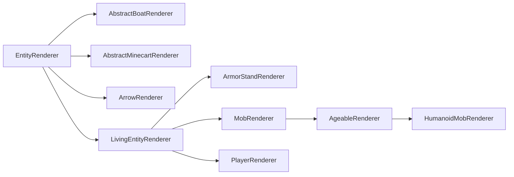

# Entity Renderers

Entity renderers are used to define rendering behavior for an entity. They only exist on the [logical and physical client][sides].

Entity rendering uses what is known as entity render states. Simply put, this is an object that holds all values that the renderer needs. Every time the entity is rendered, the render state is updated, and then the `#render` method uses that render state to render the entity. This is probably intended to be adapted into a deferred rendering system at some point, where the render information is collected beforehand (which could potentially be multithreaded) and rendering then happens at a later point in time.

## Creating an Entity Renderer

The simplest entity renderer is one that directly extends `EntityRenderer`:

```java
// The generic type in the superclass should be set to what entity you want to render.
// If you wanted to enable rendering for any entity, you'd use Entity, like we do here.
// You'd also use an EntityRenderState that fits your use case. More on this below.
public class MyEntityRenderer extends EntityRenderer<Entity, EntityRenderState> {
    // In our constructor, we just forward to super.
    public MyEntityRenderer(EntityRendererProvider.Context context) {
        super(context);
    }

    // Tell the render engine how to create a new entity render state.
    @Override
    public EntityRenderState createRenderState() {
        return new EntityRenderState();
    }

    // Update the render state by copying the needed values from the passed entity to the passed state.
    // Both Entity and EntityRenderState may be replaced with more concrete types,
    // based on the generic types that have been passed to the supertype.
    @Override
    public void extractRenderState(Entity entity, EntityRenderState state, float partialTick) {
        super.extractRenderState(entity, state, partialTick);
        // Extract and store any additional values in the state here.
    }
    
    // Actually render the entity. The first parameter matches the render state's generic type.
    // Calling super will handle leash and name tag rendering for you, if applicable.
    @Override
    public void render(EntityRenderState state, PoseStack poseStack, MultiBufferSource bufferSource, int packedLight) {
        super.render(state, poseStack, bufferSource, packedLight);
        // do your own rendering here
    }
}
```

Now that we have our entity renderer, we also need to register it and connect it to its owning entity. This is done in [`EntityRenderersEvent.RegisterRenderers`][events] like so:

```java
@SubscribeEvent // on the mod event bus only on the physical client
public static void registerEntityRenderers(EntityRenderersEvent.RegisterRenderers event) {
    event.registerEntityRenderer(MY_ENTITY_TYPE.get(), MyEntityRenderer::new);
}
```

## Entity Render States

As mentioned before, entity render states are used to separate values used for rendering from the actual entity's values. There's nothing more to them, they are really just mutable data storage objects. As such, extending is really easy:

```java
public class MyEntityRenderState extends EntityRenderState {
    public ItemStack stackInHand;
}
```

That's literally it. Extend the class, add your field, change the generic type in `EntityRenderer` to your class, and off you go. The only thing left to do now is to update that `stackInHand` field in `EntityRenderer#extractRenderState`, as explained above.

### Render State Modifications

In addition to being able to define new entity render states, NeoForge introduces a system that allows modifying existing render states.

To do so, a `ContextKey<T>` (where `T` is the type of the data you want to change) can be created and stored in a static field. Then, you can use it in an event handler for the `RegisterRenderStateModifiersEvent` like so:

```java
public static final ContextKey<String> EXAMPLE_CONTEXT = new ContextKey<>(
    // The id of your context key. Used for distinguishing between keys internally.
    ResourceLocation.fromNamespaceAndPath("examplemod", "example_context"));

@SubscribeEvent // on the mod event bus only on the physical client
public static void registerRenderStateModifiers(RegisterRenderStateModifiersEvent event) {
    event.registerEntityModifier(
        // A TypeToken for the renderer. It is REQUIRED for this to be instantiated as an anonymous class
        // (i.e., with {} at the end) and to have explicit generic parameters, due to generics nonsense.
        new TypeToken<LivingEntityRenderer<LivingEntity, LivingEntityRenderState, ?>>(){},
        // The modifier itself. This is a BiConsumer of the entity and the entity render state.
        // Exact generic types are inferred from the generics in the renderer class used.
        (entity, state) -> state.setRenderData(EXAMPLE_CONTEXT, "Hello World!");
    );
    
    // Overload of the above method that accepts a Class<?>.
    // This should ONLY be used for renderers without any generics, such as PlayerRenderer.
    event.registerEntityModifier(
        PlayerRenderer.class,
        (entity, state) -> state.setRenderData(EXAMPLE_CONTEXT, "Hello World!");
    );
}
```

:::tip
By passing `null` as the second parameter to `EntityRenderState#setRenderData`, the value can be cleared. For example:

```java
state.setRenderData(EXAMPLE_CONTEXT, null);
```
:::

This data can then be retrieved via `EntityRenderState#getRenderData` where needed. Helper methods `#getRenderDataOrThrow` and `#getRenderDataOrDefault` are available as well.

## Hierarchy

Like entities themselves, entity renderers have a class hierarchy, though not as layered. The most important classes of the hierarchy are related like this (red classes are `abstract`, blue classes are not):



- `EntityRenderer`: The abstract base class. Many renderers, notably almost all renderers for non-living entities, extend this class directly.
- `ArrowRenderer`, `AbstractBoatRenderer`, `AbstractMinecartRenderer`: These exist mainly for convenience, and are used as parents for more specific renderers.
- `LivingEntityRenderer`: The abstract base class for renderers for [living entities][livingentity]. Direct subclasses include `ArmorStandRenderer` and `PlayerRenderer`.
- `ArmorStandRenderer`: Self-explanatory.
- `PlayerRenderer`: Used to render players. Note that unlike most other renderers, multiple instances of this class used for different contexts may exist at the same time.
- `MobRenderer`: The abstract base class for renderers for `Mob`s. Many renderers extend this directly.
- `AgeableRenderer`: The abstract base class for renderers for `Mob`s that have child variants. This includes monsters with child variants, such as hoglins.
- `HumanoidMobRenderer`: The abstract base class for humanoid entity renderers. Used by e.g. zombies and skeletons.

As with the various entity classes, use what fits your use case most. Be aware that many of these classes have corresponding type bounds in their generics; for example, `LivingEntityRenderer` has type bounds for `LivingEntity` and `LivingEntityRenderState`.

## Entity Models, Layer Definitions and Render Layers

More complex entity renderers, notably `LivingEntityRenderer`, use a layer system, where each layer is represented as a `RenderLayer`. A renderer can use multiple `RenderLayer`s, and the renderer can decide what layer(s) to render at what time. For example, the elytra uses a separate layer that is rendered independently of the `LivingEntity` wearing it. Similarly, player capes are also a separate layer.

`RenderLayer`s define a `#render` method, which - surprise! - renders the layer. As with most other render methods, you can basically render whatever you want in here. However, a very common use case is to render a separate model in here, for example for armor or similar pieces of equipment.

For this, we first need a model we can render. We use the `EntityModel` class to do this. `EntityModel`s are basically a list of cubes and associated textures for the renderer to use. They are commonly created statically when the entity renderer's constructor is first created.

:::note
Since we now operate on `LivingEntityRenderer`s, the following code will assume that `MyEntity extends LivingEntity` and `MyEntityRenderState extends LivingEntityRenderState`, to match generic type bounds.
:::

### Creating an Entity Model Class and a Layer Definition

Let's start by creating an entity model class:

```java
public class MyEntityModel extends EntityModel<MyEntityRenderState> {}
```

Note that in the above example, we directly extend `EntityModel`; depending on your use case, it might be more appropriate to use one of the subclasses instead. When creating a new model, it is recommended you have a look at whatever existing model is closest to your use case, and then work from there.

Next, we create a `LayerDefinition`. A `LayerDefinition` is basically a list of cubes that we can then bake to an `EntityModel`. Defining a `LayerDefinition` looks something like this:

```java
public class MyEntityModel extends EntityModel<MyEntityRenderState> {
    // A static method in which we create our layer definition. createBodyLayer() is the name
    // most vanilla models use. If you have multiple layers, you will have multiple of these static methods.
    public static LayerDefinition createBodyLayer() {
        // Create our mesh.
        MeshDefinition mesh = new MeshDefinition();
        // The mesh initially contains no object other than the root, which is invisible (has a size of 0x0x0).
        PartDefinition root = mesh.getRoot();
        // We add a head part.
        PartDefinition head = root.addOrReplaceChild(
            // The name of the part.
            "head",
            // The CubeListBuilder we want to add.
            CubeListBuilder.create()
                // The UV coordinates to use within the texture. Texture binding itself is explained below.
                // In this example, we start at U=10, V=20.
                .texOffs(10, 20)
                // Add our cube. May be called multiple times to add multiple cubes.
                // This is relative to the parent part. For the root part, it is relative to the entity's position.
                // Be aware that the y axis is flipped, i.e. "up" is subtractive and "down" is additive.
                .addBox(
                    // The top-left-back corner of the cube, relative to the parent object's position.
                    -5, -5, -5,
                    // The size of the cube.
                    10, 10, 10
                )
                // Call texOffs and addBox again to add another cube.
                .texOffs(30, 40)
                .addBox(-1, -1, -1, 1, 1, 1)
                // Various overloads of addBox() are available, which allow for additional operations
                // such as texture mirroring, texture scaling, specifying the directions to be rendered,
                // and a global scale to all cubes, known as a CubeDeformation.
                // This example uses the latter, please check the usages of the individual methods for more examples.
                .texOffs(50, 60)
                .addBox(5, 5, 5, 4, 4, 4, CubeDeformation.extend(1.2f)),
            // The initial positioning to apply to all elements of the CubeListBuilder. Besides PartPose#offset,
            // PartPose#offsetAndRotation is also available. This can be reused across multiple PartDefinitions.
            // This may not be used by all models. For example, making custom armor layers will use the associated
            // player (or other humanoid) renderer's PartPose instead to have the armor "snap" to the player model.
            PartPose.offset(0, 8, 0)
        );
        // We can now add children to any PartDefinition, thus creating a hierarchy.
        PartDefinition part1 = root.addOrReplaceChild(...);
        PartDefinition part2 = head.addOrReplaceChild(...);
        PartDefinition part3 = part1.addOrReplaceChild(...);
        // At the end, we create a LayerDefinition from the MeshDefinition.
        // The two integers are the expected dimensions of the texture; 64x32 in our example.
        return LayerDefinition.create(mesh, 64, 32);
    }
}
```

:::tip
The [Blockbench][blockbench] modeling program is a great help in creating entity models. To do so, choose the Modded Entity option when creating your model in Blockbench.

Blockbench also has an option to export models as a `LayerDefinition` creation method, which can be found under `File -> Export -> Export Java Entity`.
:::

### Registering a Layer Definition

Once we have our entity layer definition, we need to register it in `EntityRenderersEvent.RegisterLayerDefinitions`. To do so, we need a `ModelLayerLocation`, which essentially acts as an identifier for our layer (remember, one entity can have multiple layers).

```java
// Our ModelLayerLocation.
public static final ModelLayerLocation MY_LAYER = new ModelLayerLocation(
    // Should be the name of the entity this layer belongs to.
    // May be more generic if this layer can be used on multiple entities.
    ResourceLocation.fromNamespaceAndPath("examplemod", "example_entity"),
    // The name of the layer itself. Should be main for the entity's base model,
    // and a more descriptive name (e.g. "wings") for more specific layers.
    "main"
);

@SubscribeEvent // on the mod event bus only on the physical client
public static void registerLayerDefinitions(EntityRenderersEvent.RegisterLayerDefinitions event) {
    // Add our layer here.
    event.add(MY_LAYER, MyEntityModel::createBodyLayer);
}
```

### Creating a Render Layer and Baking a Layer Definition

The next step is to bake the layer definition, something for which we will first return to the entity model class:

```java
public class MyEntityModel extends EntityModel<MyEntityRenderState> {
    // Storing specific model parts as fields for use below.
    private final ModelPart head;
    
    // The ModelPart passed here is the root of our baked model.
    // We will get to the actual baking in just a moment.
    public MyEntityModel(ModelPart root) {
        // The super constructor call can optionally specify a RenderType.
        super(root);
        // Store the head part for use below.
        this.head = root.getChild("head");
    }

    public static LayerDefinition createBodyLayer() {...}

    // Use this method to update the model rotations, visibility etc. from the render state. If you change the
    // generic parameter of the EntityModel superclass, this parameter type changes with it.
    @Override
    public void setupAnim(MyEntityRenderState state) {
        // Calling super to reset all values to default.
        super.setupAnim(state);
        // Change the model parts.
        head.visible = state.myBoolean();
        head.xRot = state.myXRotation();
        head.yRot = state.myYRotation();
        head.zRot = state.myZRotation();
    }
}
```

Now that our model is able to properly receive a baked `ModelPart`, we can create our `RenderLayer` subclass and use it for baking the `LayerDefinition` like so:

```java
// The generic parameters need the proper types you used everywhere else up to this point.
public class MyRenderLayer extends RenderLayer<MyEntityRenderState, MyEntityModel> {
    private final MyEntityModel model;
    
    // Create the render layer. The renderer parameter is required for passing to super.
    // Other parameters can be added as needed. For example, we need the EntityModelSet for model baking.
    public MyRenderLayer(MyEntityRenderer renderer, EntityModelSet entityModelSet) {
        super(renderer);
        // Bake and store our layer definition, using the ModelLayerLocation from back when we registered the layer definition.
        // If applicable, you can also store multiple models this way and use them below.
        this.model = new MyEntityModel(entityModelSet.bakeLayer(MY_LAYER));
    }

    @Override
    public void render(PoseStack poseStack, MultiBufferSource bufferSource, int packedLight, MyEntityRenderState renderState, float yRot, float xRot) {
        // Render the layer here. We have stored the entity model in a field, you probably want to use it in some way.
    }
}
```

### Adding a Render Layer to an Entity Renderer

Finally, to tie it all together, we can add the layer to our renderer (which, if you remember, now needs to be a living renderer) like so:

```java
// Plugging in our custom render state class as the generic type.
// Also, we need to implement RenderLayerParent. Some existing renderers, such as LivingEntityRenderer, do this for you.
public class MyEntityRenderer extends LivingEntityRenderer<MyEntity, MyEntityRenderState, MyEntityModel> {
    public MyEntityRenderer(EntityRendererProvider.Context context) {
        // For LivingEntityRenderer, the super constructor requires a "base" model and a shadow radius to be supplied.
        super(context, new MyEntityModel(context.bakeLayer(MY_LAYER)), 0.5f);
        // Add the layer. Get the EntityModelSet from the context. For the purpose of the example,
        // we ignore that the render layer renders the "base" model, this would be a different model in practice.
        this.addLayer(new MyRenderLayer(this, context.getModelSet()));
    }

    public MyEntityRenderState createRenderState() {
        return new MyEntityRenderState();
    }

    @Override
    public void extractRenderState(MyEntity entity, MyEntityRenderState state, float partialTick) {
        super.extractRenderState(entity, state, partialTick);
        // Extract your own stuff here, see the beginning of the article.
    }

    @Override
    public void render(MyEntityRenderState state, PoseStack poseStack, MultiBufferSource bufferSource, int packedLight) {
        // Calling super will automatically render the layer for you.
        super.render(state, poseStack, bufferSource, packedLight);
        // Then, do custom rendering here, if applicable.
    }

    // getTextureLocation is an abstract method in LivingEntityRenderer that we need to override.
    // The texture path is relative to textures/entity, so in this example, the texture should be located at
    // assets/examplemod/textures/entity/example_entity.png. The texture will then be supplied to and used by the model.
    @Override
    public ResourceLocation getTextureLocation(MyEntityRenderState state) {
        return ResourceLocation.fromNamespaceAndPath("examplemod", "example_entity");
    }
}
```

### All At Once

A bit much? Since this system is quite complex, here's all the components listed again with (almost) no fluff:

```java
public class MyEntity extends LivingEntity {...}
```

```java
public class MyEntityRenderState extends LivingEntityRenderState {...}
```

```java
public class MyEntityModel extends EntityModel<MyEntityRenderState> {
    public static final ModelLayerLocation MY_LAYER = new ModelLayerLocation(
            ResourceLocation.fromNamespaceAndPath("examplemod", "example_entity"),
            "main"
    );
    private final ModelPart head;
    
    public MyEntityModel(ModelPart root) {
        super(root);
        this.head = root.getChild("head");
        // ...
    }

    public static LayerDefinition createBodyLayer() {
        MeshDefinition mesh = new MeshDefinition();
        PartDefinition root = mesh.getRoot();
        PartDefinition head = root.addOrReplaceChild(
            "head",
            CubeListBuilder.create().texOffs(10, 20).addBox(-5, -5, -5, 10, 10, 10),
            PartPose.offset(0, 8, 0)
        );
        // ...
        return LayerDefinition.create(mesh, 64, 32);
    }

    @Override
    public void setupAnim(MyEntityRenderState state) {
        super.setupAnim(state);
        // ...
    }
}
```

```java
public class MyRenderLayer extends RenderLayer<MyEntityRenderState, MyEntityModel> {
    private final MyEntityModel model;
    
    public MyRenderLayer(MyEntityRenderer renderer, EntityModelSet entityModelSet) {
        super(renderer);
        this.model = new MyEntityModel(entityModelSet.bakeLayer(MyEntityModel.MY_LAYER));
    }

    @Override
    public void render(PoseStack poseStack, MultiBufferSource bufferSource, int packedLight, MyEntityRenderState renderState, float yRot, float xRot) {
        // ...
    }
}
```

```java
public class MyEntityRenderer extends LivingEntityRenderer<MyEntity, MyEntityRenderState, MyEntityModel> {
    public MyEntityRenderer(EntityRendererProvider.Context context) {
        super(context, new MyEntityModel(context.bakeLayer(MY_LAYER)), 0.5f);
        this.addLayer(new MyRenderLayer(this, context.getModelSet()));
    }

    public MyEntityRenderState createRenderState() {
        return new MyEntityRenderState();
    }

    @Override
    public void extractRenderState(MyEntity entity, MyEntityRenderState state, float partialTick) {
        super.extractRenderState(entity, state, partialTick);
        // ...
    }

    @Override
    public void render(MyEntityRenderState state, PoseStack poseStack, MultiBufferSource bufferSource, int packedLight) {
        super.render(state, poseStack, bufferSource, packedLight);
        // ...
    }

    @Override
    public ResourceLocation getTextureLocation(MyEntityRenderState state) {
        return ResourceLocation.fromNamespaceAndPath("examplemod", "example_entity");
    }
}
```

```java
@SubscribeEvent // on the mod event bus only on the physical client
public static void registerLayerDefinitions(EntityRenderersEvent.RegisterLayerDefinitions event) {
    event.add(MyEntityModel.MY_LAYER, MyEntityModel::createBodyLayer);
}

@SubscribeEvent // on the mod event bus only on the physical client
public static void registerEntityRenderers(EntityRenderersEvent.RegisterRenderers event) {
    event.registerEntityRenderer(MY_ENTITY_TYPE.get(), MyEntityRenderer::new);
}
```

## Modifying Existing Entity Renderers

In some scenarios, it is desirable to add to an existing entity renderer, e.g. for rendering additional effects on an existing entity. Most of the time, this will affect living entities, i.e., entities with a `LivingEntityRenderer`. This enables us to add [render layers][renderlayer] to an entity like so:

```java
@SubscribeEvent // on the mod event bus only on the physical client
public static void addLayers(EntityRenderersEvent.AddLayers event) {
    // Add a layer to every single entity type.
    for (EntityType<?> entityType : event.getEntityTypes()) {
        // Get our renderer.
        EntityRenderer<?, ?> renderer = event.getRenderer(entityType);
        // We check if our render layer is supported by the renderer.
        // If you want a more general-purpose render layer, you will need to work with wildcard generics.
        if (renderer instanceof MyEntityRenderer myEntityRenderer) {
            // Add the layer to the renderer. Like above, construct a new MyRenderLayer.
            // The EntityModelSet can be retrieved from the event through #getEntityModels.
            myEntityRenderer.addLayer(new MyRenderLayer(renderer, event.getEntityModels()));
        }
    }
}
```

For players, a bit of special-casing is required because there can actually be multiple player renderers. These are managed separately by the event. We can interact with them like so:

```java
@SubscribeEvent // on the mod event bus only on the physical client
public static void addPlayerLayers(EntityRenderersEvent.AddLayers event) {
    // Iterate over all possible player models.
    for (PlayerSkin.Model skin : event.getSkins()) {
        // Get the associated PlayerRenderer.
        if (event.getSkin(skin) instanceof PlayerRenderer playerRenderer) {
            // Add the layer to the renderer. This assumes that the render layer
            // has proper generics to support players and player renderers.
            playerRenderer.addLayer(new MyRenderLayer(playerRenderer, event.getEntityModels()));
        }
    }
}
```

## Animations

Minecraft includes an animation system for entity models through the `AnimationState` class. NeoForge adds a system that allows these entity animations to be defined in JSON files, similar to third-party libraries such as [GeckoLib][geckolib].

Animations are defined in JSON files located at `assets/<namespace>/neoforge/animations/entity/<path>.json` (so for the [resource location][rl] `examplemod:example`, the file would be located at `assets/examplemod/neoforge/animations/entity/example.json`). The format of an animation file is as follows:

```json5
{
    // The duration of the animation, in seconds.
    "length": 1.5,
    // Whether the animation should loop (true) or stop (false) when finished.
    // Optional, defaults to false.
    "loop": true,
    // A list of parts to be animated, and their animation data.
    "animations": [
        {
            // The name of the part to be animated. Must match the name of a part
            // defined in your LayerDefinition (see above). If there are multiple matches,
            // the first match from the performed depth-first search will be picked.
            "bone": "head",
            // The value to be changed. See below for available targets.
            "target": "minecraft:rotation",
            // A list of keyframes for the part.
            "keyframes": [
                {
                    // The timestamp of the keyframe, in seconds.
                    // Should be between 0 and the animation length.
                    "timestamp": 0.5,
                    // The actual "value" of the keyframe.
                    "target": [22.5, 0, 0],
                    // The interpolation method to use. See below for available methods.
                    "interpolation": "minecraft:linear"
                }
            ]
        }
    ]
}
```

:::tip
It is highly recommended to use this system in combination with the [Blockbench][blockbench] modeling software, which offers an [animation to JSON plugin][bbplugin].
:::

In your model, you can then use the animation like so:

```java
public class MyEntityModel extends EntityModel<MyEntityRenderState> {
    // Create and store a reference to the model.
    public static final AnimationHolder EXAMPLE_ANIMATION =
            Model.getAnimation(ResourceLocation.fromNamespaceAndPath("examplemod", "example"));
    
    // Other stuff here.
    
    @Override
    public void setupAnim(MyEntityRenderState state) {
        super.setupAnim(state);
        // Other stuff here.
        
        animate(
            // Get the animation state to use from your EntityRenderState.
            state.myAnimationState,
            // Your animation holder.
            EXAMPLE_ANIMATION,
            // Your entity age, in ticks.
            state.ageInTicks
        );
        // A specialized version of animate(), designed for walking animations.
        animateWalk(EXAMPLE_ANIMATION, state.walkAnimationPos, state.walkAnimationSpeed, 1, 1);
        // A version of animate() that only applies the first frame of animation.
        applyStatic(EXAMPLE_ANIMATION).
    }
}
```

### Keyframe Targets

NeoForge adds the following keyframe targets out of the box:

- `minecraft:position`: The target values are set as the position values of the part.
- `minecraft:rotation`: The target values are set as the rotation values of the part.
- `minecraft:scale`: The target values are set as the scale values of the part.

Custom values can be added by creating a new `AnimationTarget` and registering it in `RegisterJsonAnimationTypesEvent` like so:

```java
@SubscribeEvent // on the mod event bus only on the physical client
public static void registerJsonAnimationTypes(RegisterJsonAnimationTypesEvent event) {
    event.registerTarget(
        // The name of the new target, to be used in JSON and other places.
        ResourceLocation.fromNamespaceAndPath("examplemod", "example"),
        // The AnimationTarget to register.
        new AnimationTarget(...)
    );
}
```

### Keyframe Interpolations

NeoForge adds the following keyframe interpolations out of the box:

- `minecraft:linear`: Linear interpolation.
- `minecraft:catmullrom`: Interpolation along a [Catmull-Rom spline][catmullrom].

Custom interpolations can be added by creating a new `AnimationChannel.Interpolation` (which is a functional interface) and registering it in `RegisterJsonAnimationTypesEvent` like so:

```java
@SubscribeEvent // on the mod event bus only on the physical client
public static void registerJsonAnimationTypes(RegisterJsonAnimationTypesEvent event) {
    event.registerInterpolation(
        // The name of the new interpolation, to be used in JSON and other places.
        ResourceLocation.fromNamespaceAndPath("examplemod", "example"),
        // The AnimationChannel.Interpolation to register.
        (vector, keyframeDelta, keyframes, currentKeyframe, nextKeyframe, scale) -> {...}
    );
}
```

[bbplugin]: https://www.blockbench.net/plugins/animation_to_json
[blockbench]: https://www.blockbench.net/
[catmullrom]: https://en.wikipedia.org/wiki/Cubic_Hermite_spline#Catmull–Rom_spline
[events]: ../concepts/events.md
[geckolib]: https://github.com/bernie-g/geckolib
[livingentity]: livingentity.md
[renderlayer]: #creating-a-render-layer-and-baking-a-layer-definition
[rl]: ../misc/resourcelocation.md
[sides]: ../concepts/sides.md
