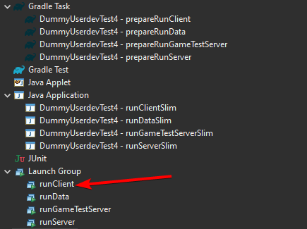

# ForgeGradle 5 -> 6 迁移入门

这是一个关于如何将你的构建脚本从ForgeGradle 5迁移到6的高级、非详尽的概述。

如果有任何不正确或遗漏的信息，请在下面留言。谢谢！

## 添加Foojay Toolchains插件

Gradle现在使用[Foojay Toolchains插件](https://github.com/gradle/foojay-toolchains)以管理Java工具链。必须将插件添加到`settings.gradle[.kts]`中：

使用Gradle DSL:

```gradle
// 在settings.gradle中
plugins {
    id 'org.gradle.toolchains.foojay-resolver-convention' version '0.5.0'
}
```

使用Kotlin DSL:

```kotlin
// 在settings.gradle.kts中
plugins {
    id("org.gradle.toolchains.foojay-resolver-convention") version "0.5.0"
}
```

## 将Gradle升级到8.1.1

首先，你需要更新Gradle Wrapper以使用8.1.1。你可以在[Gradle的迁移指南](https://docs.gradle.org/current/userguide/upgrading_version_7.html)上找到有关从7迁移到8的其他信息。

这可以通过以下两种方式之一实现：

### `gradle wrapper`

首选选项是将`gradle wrapper`命令与`--gradle-version`选项一起使用。

```bash
# 在Gradle项目的根目录内部
./gradlew wrapper --gradle-version=8.1.1
```

### gradle-wrapper.properties

不建议使用此方法，并且只有在上面的`gradlew wrapper`命令失败时才应使用此方法。

更新`gradle/wrapper/gradle-wrapper.properties`中的`distributionUrl`属性中的版本。然后运行`./gradlew wrapper`。

```properties
distributionUrl=https\://services.gradle.org/distributions/gradle-8.1.1-bin.zip
```

## 更新ForgeGradle插件版本

更新Gradle后，将`build.gradle[.kts]`中的`ForgeGradle`版本更新为`[6.0,6.2)`：

使用Gradle DSL:

```gradle
// 在build.gradle中
plugins {
    id 'net.minecraftforge.gradle' version '[6.0,6.2)'
}
```

使用Kotlin DSL:

```kotlin
// 在build.gradle.kts中
plugins {
    id("net.minecraftforge.gradle") version "[6.0,6.2)"
}
```

## 从运行配置中移除`forceExit`

ForgeGradle现已删除运行配置中的`forceExit`属性。对运行任务的更改仅适用于当前项目，不适用于任何子项目。

### 次要的添加、变更和移除

### 重新混淆的Classpath继承

如果你在`reobf*`任务配置中使用`classpath.from`来声明额外的库，则需要考虑`reobf*`任务；它应该迁移到`libraries.from`属性。

### Eclipse启动器组（Launcher Groups）

如果ForgeGradle的设置使得Eclipse应该在开始游戏之前运行Gradle任务，那么你必须从`Launch Group`文件夹执行运行配置。只有在`minecraft`块中启用了新属性时，情况才会如此。



### ModConfig中`resources`和`classes`的移除

运行配置的`mods`块中的属性`resources`和`classes`已从ForgeGradle 6中移除。
