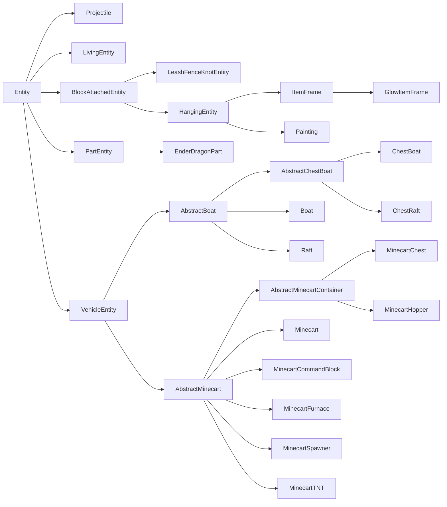
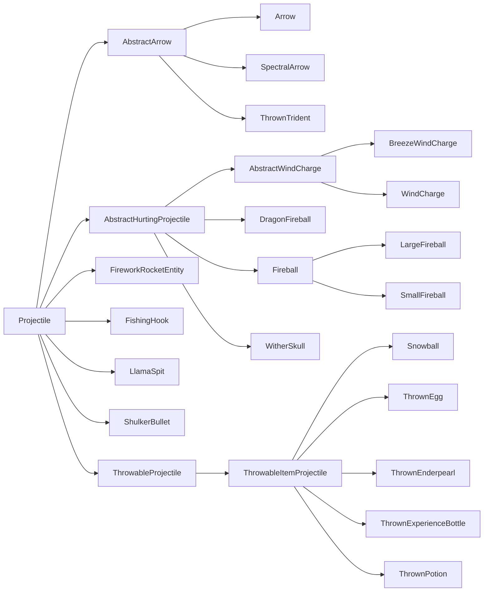

# Entities

Entities are in-world objects that can interact with the world in a variety of ways. Common example include mobs, projectiles, rideable objects, and even players. Each entity consists of multiple systems that may not seem understandable at first glance. This section will break down some of the key components related to constructing an entity and making it behave as the modder intends.

## Terminology

A simple entity is made up of three parts:

- The [`Entity`][entity] subclass, which holds most of our entity's logic
- The [`EntityType`][type], which is [registered][registration] and holds some common properties, and
- The [`EntityRenderer`][renderer], which is responsible for displaying the entity in-game

More complex entities may require more parts. For example, many of the more complex `EntityRenderer`s use an underlying `EntityModel` instance. Or, a naturally spawning entity will need some sort of [spawn mechanism][spawning].

## `EntityType`

The relationship between `EntityType`s and `Entity`s is similar to that of [`Item`s][item] and [`ItemStack`s][itemstack]. Like `Item`s, `EntityType`s are singletons that are registered to their corresponding registry (the entity type registry) and hold some values common to all entities of that type, while `Entity`s, like `ItemStack`s, are "instances" of that singleton type that hold data specific to that one entity instance. However, the key difference here is that most of the behavior is not defined in the singleton `EntityType`, but rather in the instantiated `Entity` class itself.

Let's create our `EntityType` registry and register an `EntityType` for it, assuming we have a class `MyEntity` that extends `Entity` (see [below][entity] for more information). All methods on `EntityType.Builder`, except for the `#build` call at the end, are optional.

```java
public static final DeferredRegister.Entities ENTITY_TYPES =
    DeferredRegister.createEntities(ExampleMod.MOD_ID);

public static final Supplier<EntityType<MyEntity>> MY_ENTITY = ENTITY_TYPES.register(
    "my_entity",
    // The entity type, created using a builder.
    () -> EntityType.Builder.of(
        // An EntityType.EntityFactory<T>, where T is the entity class used - MyEntity in this case.
        // You can think of it as a BiFunction<EntityType<T>, Level, T>.
        // This is commonly a reference to the entity constructor.
        MyEntity::new,
        // The MobCategory our entity uses. This is mainly relevant for spawning.
        // See below for more information.
        MobCategory.MISC
    )
    // The width and height, in blocks. The width is used in both horizontal directions.
    // This also means that non-square footprints are not supported. Default is 0.6f and 1.8f.
    .sized(1.0f, 1.0f)
    // A multiplicative factor (scalar) used by mobs that spawn in varying sizes.
    // In vanilla, these are only slimes and magma cubes, both of which use 4.0f.
    .spawnDimensionsScale(4.0f)
    // The eye height, in blocks from the bottom of the size. Defaults to height * 0.85.
    // This must be called after #sized to have an effect.
    .eyeHeight(0.5f)
    // Disables the entity being summonable via /summon.
    .noSummon()
    // Prevents the entity from being saved to disk.
    .noSave()
    // Makes the entity fire immune.
    .fireImmune()
    // Makes the entity immune to damage from a certain block. Vanilla uses this to make
    // foxes immune to sweet berry bushes, withers and wither skeletons immune to wither roses,
    // and polar bears, snow golems and strays immune to powder snow.
    .immuneTo(Blocks.POWDER_SNOW)
    // Disables a rule in the spawn handler that limits the distance at which entities can spawn.
    // This means that no matter the distance to the player, this entity can spawn.
    // Vanilla enables this for pillagers and shulkers.
    .canSpawnFarFromPlayer()
    // The range in which the entity is kept loaded by the client, in chunks.
    // Vanilla values for this vary, but it's often something around 8 or 10. Defaults to 5.
    // Be aware that if this is greater than the client's chunk view distance,
    // then that chunk view distance is effectively used here instead.
    .clientTrackingRange(8)
    // How often update packets are sent for this entity, in once every x ticks. This is set to higher values
    // for entities that have predictable movement patterns, for example projectiles. Defaults to 3.
    .updateInterval(10)
    // Build the entity type using a resource key. The second parameter should be the same as the entity id.
    .build(ResourceKey.create(
        Registries.ENTITY_TYPE,
        ResourceLocation.fromNamespaceAndPath("examplemod", "my_entity")
    ))
);

// Shorthand version to avoid boilerplate. The following call is the same as
// ENTITY_TYPES.register("my_entity", () -> EntityType.Builder.of(MyEntity::new, MobCategory.MISC).build(
//     ResourceKey.create(Registries.ENTITY_TYPE, ResourceLocation.fromNamespaceAndPath("examplemod", "my_entity"))
// );
public static final Supplier<EntityType<MyEntity>> MY_ENTITY =
    ENTITY_TYPES.registerEntityType("my_entity", MyEntity::new, MobCategory.MISC);

// Shorthand version that still allows calling additional builder methods
// by supplying a UnaryOperator<EntityType.Builder> parameter.
public static final Supplier<EntityType<MyEntity>> MY_ENTITY = ENTITY_TYPES.registerEntityType(
    "my_entity", MyEntity::new, MobCategory.MISC,
    builder -> builder.sized(2.0f, 2.0f).eyeHeight(1.5f).updateInterval(5));
```

### `MobCategory`

_See also [Natural Spawning][mobspawn]._

An entity's `MobCategory` determines some properties for the entity, which are related to [spawning and despawning][mobspawn]. Vanilla adds a total of eight `MobCategory`s by default:

| Name                         | Spawn Cap | Examples                                                                                                                       |
|------------------------------|-----------|--------------------------------------------------------------------------------------------------------------------------------|
| `MONSTER`                    | 70        | Various monsters                                                                                                               |
| `CREATURE`                   | 10        | Various animals                                                                                                                |
| `AMBIENT`                    | 15        | Bats                                                                                                                           |
| `AXOLOTS`                    | 5         | Axolotls                                                                                                                       |
| `UNDERGROUND_WATER_CREATURE` | 5         | Glow Squids                                                                                                                    |
| `WATER_CREATURE`             | 5         | Squids, Dolphins                                                                                                               |
| `WATER_AMBIENT`              | 20        | Fish                                                                                                                           |
| `MISC`                       | N/A       | All non-living entities, e.g. projectiles; using this `MobCategory` will make the entity unable to be spawned naturally at all |

There are also some other properties that are only set on one or two `MobCategory`s each:

- `isFriendly`: Set to false for `MONSTER`, and true for all others.
- `isPersistent`: Set to true for `CREATURE` and `MISC`, and false for all others.
- `despawnDistance`: Set to 64 for `WATER_AMBIENT`, and 128 for all others.

:::info
`MobCategory` is an [extensible enum][extenum], meaning that you can add custom entries to it. If you do so, you will also have to add some spawning mechanism for entities of this custom `MobCategory`.
:::

## The Entity Class

To begin, we create an `Entity` subclass. Alongside a constructor, `Entity` (which is an abstract class) defines four required methods that we are required to implement. The first three will be explained in the [Data and Networking article][data], in order to not further bloat this article, and `#hurtServer` is explained in the [Damaging Entities section][damaging].

```java
public class MyEntity extends Entity {
    // We inherit this constructor without the bound on the generic wildcard.
    // The bound is needed for registration below, so we add it here.
    public MyEntity(EntityType<? extends MyEntity> type, Level level) {
        super(type, level);
    }

    // See the Data and Networking article for information about these methods.
    @Override
    protected void readAdditionalSaveData(CompoundTag compoundTag) {}

    @Override
    protected void addAdditionalSaveData(CompoundTag compoundTag) {}

    @Override
    protected void defineSynchedData(SynchedEntityData.Builder builder) {}

    @Override
    public boolean hurtServer(ServerLevel level, DamageSource damageSource, float amount) {
        return true;
    }
}
```

:::info
While `Entity` can be extended directly, it often makes sense to use one of its many subclasses as a base instead. See the [entity class hierarchy][hierarchy] for more information.
:::

If required (e.g. because you're spawning entities from code), you can also add custom constructors. These generally hardcode the entity type as a reference to the registered object, like so:

```java
public MyEntity(EntityType<? extends MyEntity> type, Level level, double x, double y, double z) {
    // Delegates to the factory constructor, using the EntityType we registered before.
    this(type, level);
    this.setPos(x, y, z);
}
```

:::warning
Custom constructors should never have exactly two parameters, as that will cause confusion with the `(EntityType, Level)` constructor above.
:::

And now, we are free to do basically whatever we want with our entity. The following subsections will display a variety of common entity use cases.

### Data Storage on Entities

_See [Entities/Data and Networking][data]._

### Rendering Entities

_See [Entities/Entity Renderers][renderer]._

### Spawning Entities

If we now boot up the game now and enter a world, we have exactly one way of spawning: through the [`/summon`][summon] command (assuming `EntityType.Builder#noSummon` was not called).

Obviously, we want to add our entities some other way. The easiest way to do so is through the `LevelWriter#addFreshEntity` method. This method simply accepts an `Entity` instance and adds it to the world, like so:

```java
// In some method that has a level available, only on the server
if (!level.isClientSide()) {
    MyEntity entity = new MyEntity(level, 100.0, 200.0, 300.0);
    level.addFreshEntity(entity);
}
```

Alternatively, you can also call `EntityType#spawn`, which is especially recommended when spawning [living entities][livingentity], as it does some additional setup, such as firing the spawn [events][event].

This will be used for pretty much all non-living entities. Players should obviously not be spawned yourself, `Mob`s have [their own ways of spawning][mobspawn] (though they can also be added via `#addFreshEntity`), and vanilla [projectiles][projectile] also have static helpers for spawning in the `Projectile` class.

### Damaging Entities

_See also [Left-Clicking an Item][leftclick]._

While not all entities have the concept of hit points, they can still all receive damage. This is not only used by things like mobs and players: If you cast your mind to item entities (dropped items), they too can take damage from sources like fire or cacti, in which case they are usually deleted immediately.

Damaging an entity is possible by calling either `Entity#hurt` or `Entity#hurtOrSimulate`, the difference between those two is explained below. Both methods take two arguments: the [`DamageSource`][damagesource] and the damage amount, as a float in half hearts. For example, calling `entity.hurt(entity.damageSources().wither(), 4.25)` will cause a little over two hearts of wither damage.

In turn, entities can also modify that behavior. This isn't done by overriding `#hurt`, as it is a final method. Rather, there are two methods `#hurtServer` and `#hurtClient` that each handle damage logic for the corresponding side. `#hurtClient` is commonly used to tell the client that an attack has succeeded, even though that may not always be true, mainly for playing attack sounds and other effects regardless. For changing damage behavior, we mainly care about `#hurtServer`, which we can override like so:

```java
@Override
// The boolean return value determines whether the entity was actually damaged or not.
public boolean hurtServer(ServerLevel level, DamageSource damageSource, float amount) {
    if (damageSource.is(DamageTypeTags.IS_FIRE)) {
        // This assumes that super#hurt() is implemented. Common other ways to do this
        // are to set some field yourself. Vanilla implementations vary greatly across different entities.
        // Notably, living entities usually call #actuallyHurt, which in turn calls #setHealth.
        return super.hurt(level, damageSource, amount * 2);
    } else {
        return false;
    }
}
```

This server/client separation is also the difference between `Entity#hurt` and `Entity#hurtOrSimulate`: `Entity#hurt` only runs on the server (and calls `Entity#hurtServer`), whereas `Entity#hurtOrSimulate` runs on both sides, calling `Entity#hurtServer` or `Entity#hurtClient` depending on the side.

It is also possible to modify damage done to entities that do not belong to you, i.e. those added by Minecraft or other mods, through events. These events contain a lot of code specific to `LivingEntity`s; as such, their documentation resides in the [Damage Events section][damageevents] within the [Living Entities article][livingentity].

### Ticking Entities

Quite often, you will want your entity to do something (e.g. move) every tick. This logic is split across several methods:

- `#tick`: This is the central tick method, and the one you will want to override in 99% of cases.
    - By default, this forwards to `#baseTick`, however this is overridden by almost every subclass.
- `#baseTick`: This method handles updating some values common to all entities, including the "on fire" state, freezing from powder snow, the swimming state, and passing through portals. `LivingEntity` additionally handles drowning, in-block damage, and updates to the damage tracker here. Override this method if you want to change or add to that logic.
    - By default, `Entity#tick` will forward to this method.
- `#rideTick`: This method is called for passengers of other entities, for example for players riding horses, or any entity that rides another entity due to use of the `/ride` command.
    - By default, this does some checks and then calls `#tick`. Skeletons and players override this method for special handling of riding entities.

Additionally, the entity has a field called `tickCount`, which is the time, in ticks, that the entity has existed in the level, and a boolean field named `firstTick`, which should be self-explanatory. For example, if you wanted to [spawn a particle][particle] every 5 ticks, you could use the following code:

```java
@Override
public void tick() {
    // Always call super unless you have a good reason not to.
    super.tick();
    // Run this code once every 5 ticks, and make sure we spawn the particle on the server.
    if (this.tickCount % 5 == 0 && !level().isClientSide()) {
        level().addParticle(...);
    }
}
```

### Picking Entities

_See also [Middle-Clicking][middleclick]._

Picking is the process of selecting the thing that the player is currently looking at, as well as subsequently picking the associated item. The result of middle-clicking, known as the "pick result", can be modified by your entity (be aware that the `Mob` class will select the correct spawn egg for you):

```java
@Override
@Nullable
public ItemStack getPickResult() {
    // Assumes that MY_CUSTOM_ITEM is a DeferredItem<?>, see the Items article for more information.
    // If the entity should not be pickable, it is advised to return null here.
    return new ItemStack(MY_CUSTOM_ITEM.get());
}
```

While entities should generally be pickable, there are some niche cases where this isn't desirable. A vanilla use case for this is the ender dragon, which consists of multiple parts. The parent entity has picking disabled, but the parts have it enabled again, for finer hitbox tuning.

If you have a similarly niche use case, your entity can also be disabled from picking entirely like so:

```java
@Override
public boolean isPickable() {
    // Additional checks may be performed here if needed.
    return false;
}
```

If you want to do the picking (i.e. ray casting) yourself, you can call `Entity#pick` on the entity that you want to start the ray cast from. This will return a [`HitResult`][hitresult] that you can further check for what exactly has been hit by the ray cast.

### Entity Attachments

_Not to be confused with [Data Attachments][dataattachments]._

Entity attachments are used to define visual attachment points for the entity. Using this system, it can be defined where things like passengers or name tags will be displayed relative to the entity itself. The entity itself controls only the default position of the attachment, and the attachment can then define an offset from that default.

When building the `EntityType`, any amount of attachment points can be set by calling `EntityType.Builder#attach`. This method accepts an `EntityAttachment`, which defines the attachment to consider, and three floats to define the position (x/y/z). The position should be defined relative to where the default value of the attachment would be.

Vanilla defines the following four `EntityAttachment`s:

| Name           | Default                                  | Usages                                                               |
|----------------|------------------------------------------|----------------------------------------------------------------------|
| `PASSENGER`    | Center X/top Y/center Z of the hitbox    | Rideable entities, e.g. horses, to define where passengers appear    |
| `VEHICLE`      | Center X/bottom Y/center Z of the hitbox | All entities, to define where they appear when riding another entity |
| `NAME_TAG`     | Center X/top Y/center Z of the hitbox    | Define where the name tag of the entity appears, if applicable       |
| `WARDEN_CHEST` | Center X/center Y/center Z of the hitbox | By wardens, to define where the sonic boom attack originates from    |

:::info
`PASSENGER` and `VEHICLE` are related in that they are used in the same context. First, `PASSENGER` is applied to position the rider. Then, `VEHICLE` is applied on the rider.
:::

Every attachment can be thought of as a mapping from `EntityAttachment` to `List<Vec3>`. The amount of points actually used depends on the consuming system. For example, boats and camels will use two `PASSENGER` points, while entities like horses or minecarts will only use one `PASSENGER` point.

`EntityType.Builder` also has some helpers related to `EntityAttachment`s:

- `#passengerAttachment()`: Used to define `PASSENGER` attachments. Comes in two variants.
    - One variant accepts a `Vec3...` of attachment points.
    - The other accepts a `float...`, which forwards to the `Vec3...` variant by transforming each float to a `Vec3` that uses the given float as the y value, and sets x and z to 0.
- `#vehicleAttachment()`: Used to define a `VEHICLE` attachment. Accepts a `Vec3`.
- `#ridingOffset()`: Used to define a `VEHICLE` attachment. Accepts a float and forwards to `#vehicleAttachment()` with a `Vec3` that has its x and z values set to 0, and the y value set to the negated value of the passed-in float.
- `#nameTagOffset()`: Used to define a `NAME_TAG` attachment. Accepts a float, which is used for the y value, with 0 being used for the x and z values.

Alternatively, attachments can be defined yourself by calling `EntityAttachments#builder()` and then calling `#attach()` on that builder, like so:

```java
// In some EntityType<?> creation
EntityType.Builder.of(...)
    // This EntityAttachment will make name tags float half a block above the ground.
    // If this is not set, it will default to the entity's hitbox height.
    .attach(EntityAttachment.NAME_TAG, 0, 0.5f, 0)
    .build();
```

## Entity Class Hierarchy

Due to the many different types of entities, there is a complex hierarchy of subclasses of `Entity`. These are important to know about when choosing what class to extend when making your own entity, as you will be able to save a lot of work by reusing their code.

The vanilla entity hierarchy looks like this (red classes are `abstract`, blue classes are not):



Let's break these down:

- `Projectile`: The base class for various projectiles, including arrows, fireballs, snowballs, fireworks and similar entities. Read more about them [below][projectile].
- `LivingEntity`: The base class for anything "living", in the sense of it having things like hit points, equipment, [mob effects][mobeffect] and some other properties. Includes things such as monsters, animals, villagers, and players. Read more about them in the [Living Entities article][livingentity].
- `BlockAttachedEntity`: The base class for entities that are immobile and attached to blocks. Includes leash knots, item frames and paintings. The subclasses mainly serve the purpose of reusing common code.
- `PartEntity`: The base class for part entities, i.e. entities made up of multiple smaller entities. Vanilla currently only uses this for the Ender Dragon.
- `VehicleEntity`: The base class for boats and minecarts. While these entities loosely share the concept of hit points with `LivingEntity`s, they do not share many other properties with them and are as such kept separated. The subclasses mainly serve the purpose of reusing common code.

There are also several entities that are direct subclasses of `Entity`, simply because there was no other fitting superclass. Most of these should be self-explanatory:

- `AreaEffectCloud` (lingering potion clouds)
- `EndCrystal`
- `EvokerFangs`
- `ExperienceOrb`
- `EyeOfEnder`
- `FallingBlockEntity` (falling sand, gravel etc.)
- `ItemEntity` (dropped items)
- `LightningBolt`
- `OminousItemSpawner` (for continuously spawning the loot of trial spawners)
- `PrimedTnt`

Not included in this diagram and list are the mapmaker entities (displays, interactions and markers).

### Projectiles

Projectiles are a subgroup of entities. Common to them is that they fly in one direction until they hit something, and that they have an owner assigned to them (e.g. a player or a skeleton would be the owner of an arrow, or a ghast would be the owner of a fireball).

The class hierarchy of projectiles looks as follows (red classes are `abstract`, blue classes are not):



Of note are the three direct abstract subclasses of `Projectile`:

- `AbstractArrow`: This class covers the different kinds of arrows, as well as the trident. An important common property is that they will not fly straight, but are affected by gravity.
- `AbstractHurtingProjectile`: This class covers wind charges, various fireballs, and wither skulls. These are damaging projectiles unaffected by gravity.
- `ThrowableProjectile`: This class covers things like eggs, snowballs and ender pearls. Like arrows, they are affected by gravity, but unlike arrows, they will not inflict damage upon hitting the target. They are also all spawned by using the corresponding [item].

A new projectile can be created by extending `Projectile` or a fitting subclass, and then overriding the methods required for adding your functionality. Common methods to override include:

- `#shoot`: Calculates and sets the correct velocity on the projectile.
- `#onHit`: Called when something is hit.
    - `#onHitEntity`: Called when that something is an [entity].
    - `#onHitBlock`: Called when that something is a [block].
- `#getOwner` and `#setOwner`, which get and set the owning entity, respectively.
- `#deflect`, which deflects the projectile based on the passed `ProjectileDeflection` enum value.
- `#onDeflection`, which is called from `#deflect` for any post-deflection behavior.

[block]: ../blocks/index.md
[damageevents]: livingentity.md#damage-events
[damagesource]: ../resources/server/damagetypes.md#creating-and-using-damage-sources
[damaging]: #damaging-entities
[data]: data.md
[dataattachments]: ../datastorage/attachments.md
[entity]: #the-entity-class
[event]: ../concepts/events.md
[extenum]: ../advanced/extensibleenums.md
[hierarchy]: #entity-class-hierarchy
[hitresult]: ../items/interactions.md#hitresults
[item]: ../items/index.md
[itemstack]: ../items/index.md#itemstacks
[leftclick]: ../items/interactions.md#left-clicking-an-item
[livingentity]: livingentity.md
[middleclick]: ../items/interactions.md#middle-clicking
[mobeffect]: ../items/mobeffects.md
[mobspawn]: livingentity.md#spawning
[particle]: ../resources/client/particles.md
[projectile]: #projectiles
[registration]: ../concepts/registries.md#methods-for-registering
[renderer]: renderer.md
[spawning]: #spawning-entities
[summon]: https://minecraft.wiki/w/Commands/summon
[type]: #entitytype
