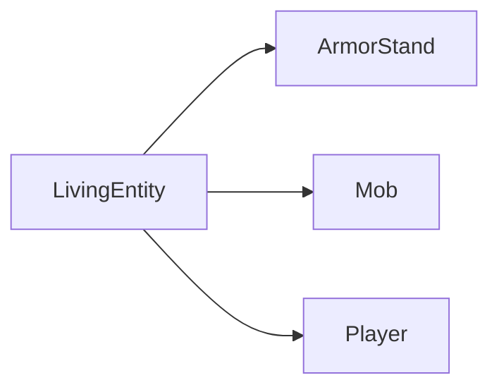
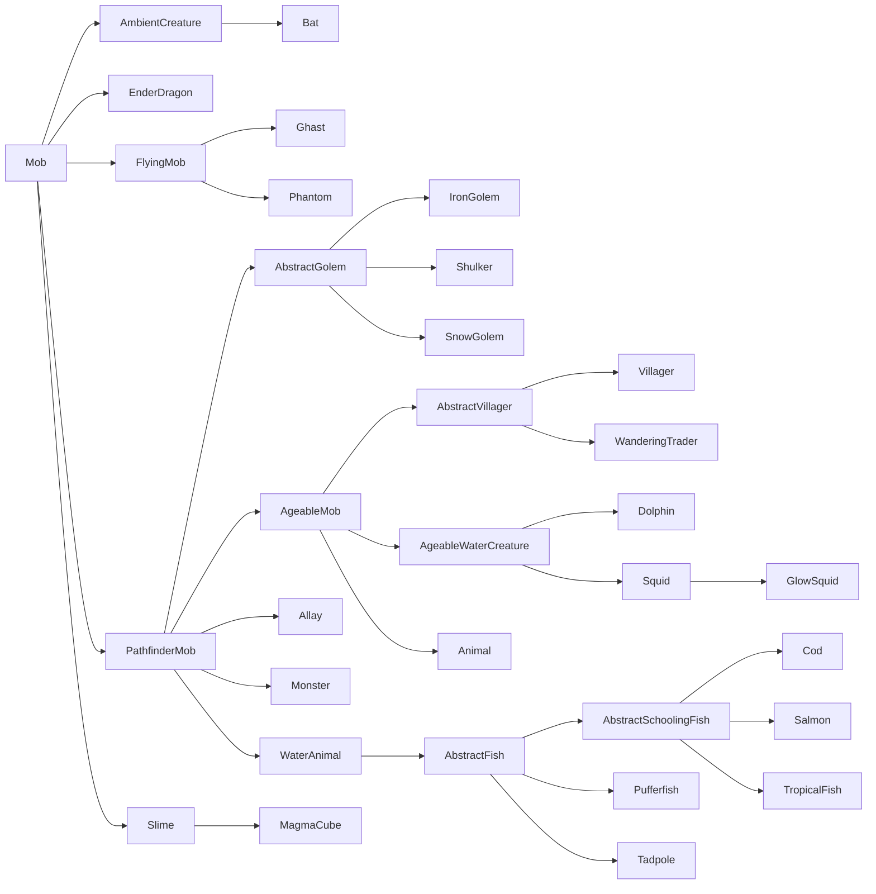
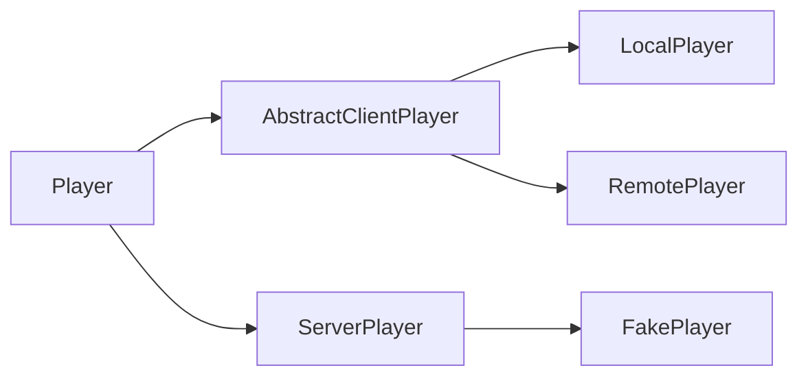

# Living Entities, Mobs & Players

Living entities are a big subgroup of [entities] that all inherit from the common `LivingEntity` superclass. These include mobs (through the `Mob` subclass), players (through the `Player` subclass) and armor stands (through the `ArmorStand` subclass).

Living entities have a number of additional properties that regular entities do not have. These include [attributes], [mob effects][mobeffects], damage tracking and more.

## Health, Damage and Healing

_See also: [Attributes][attributes]._

One of the most notable features that sets living entities apart from others is the fully-fleshed health system. Living entities generally have a max health, a current health and sometimes things such as armor or natural regeneration.

By default, max health is determined by the `minecraft:generic.max_health` [attribute][attributes], and the current health is set to the same value when [spawning]. When the entity is damaged by calling [`Entity#hurt`][hurt] on it, the current health is decreased according to the damage calculations. Many entities, such as zombies, will by default then remain at that reduced health value, while some, such as players, can heal these lost hit points again.

To get or set the max health value, the attribute is read or written directly, like so:

```java
// Get the attribute map of our entity.
AttributeMap attributes = entity.getAttributes();

// Get the max health of our entity.
float maxHealth = attributes.getValue(Attributes.MAX_HEALTH);
// Shortcut for the above.
maxHealth = entity.getMaxHealth();

// Setting the max health must either be done by getting the AttributeInstance and calling #setBaseValue, or by
// adding an attribute modifier. We will do the former here. Please refer to the Attributes article for more details.
attributes.getInstance(Attributes.MAX_HEALTH).setBaseValue(50);
```

When [taking damage][damage], living entities will apply some additional calculations, such as considering the `minecraft:generic.armor` attribute (except for [damage types][damagetypes] that are in the `minecraft:bypasses_armor` [tag][tags]) as well as the `minecraft:generic.absorption` attribute. Living entities can also override `#onDamageTaken` to perform post-attack behavior; it is only called if the final damage value is greater than zero.

### Damage Events

Due to the complexity of the damage pipeline, there are multiple events for you to hook into, which are fired in the order they are listed in. This is generally intended for damage modifications you want to do to entities that are not (or not necessarily) your own, i.e. if you want to modify damage done to entities from Minecraft or other mods, or if you want to modify damage done to any entity, which may or may not be your own.

Common to all these events is the `DamageContainer`. A new `DamageContainer` is instantiated at the start of the attack, and discarded after the attack has finished. It contains the original [`DamageSource`][damagesources], the original damage amount, and a list of all individual modifications - armor, absorption, [enchantments], [mob effects][mobeffects], etc. The `DamageContainer` is passed to all events listed below, and you can check what modifications have already been done to make your own changes as necessary.

#### `EntityInvulnerabilityCheckEvent`

This event allows mods to both bypass and add invulnerabilities for an entity. This event is also fired for non-living entities. You would use this event to make an entity immune to an attack, or strip away an existing immunity it may have.

For technical reasons, hooks to this event should be deterministic and only depend on the damage type. This means that random chances for invulnerabilities, or invulnerabilities that only apply up to a certain damage amount, should instead be added in `LivingIncomingDamageEvent` (see below).

#### `LivingIncomingDamageEvent`

This event is called only on the server side and should be used for two main use cases: dynamically cancelling the attack, and adding reduction modifier callbacks.

Dynamically cancelling attacks is basically adding a non-deterministic invulnerability, for example a random chance to cancel damage, an invulnerability depending on the time of day or the amount of damage taken, etc. Consistent invulnerabilities should be performed via `EntityInvulnerabilityCheckEvent` (see above).

Reduction modifier callbacks allow you to modify a part of the performed damage reduction. For example, it would allow you to reduce the effect of armor damage reduction by 50%. This would then also propagate correctly to mob effects, which then have a different damage amount to work with, etc. A reduction modifier callback can be added like so:

```java
@SubscribeEvent // on the game event bus
public static void decreaseArmor(LivingIncomingDamageEvent event) {
    // We only apply this decrease to players and leave zombies etc. unchanged
    if (event.getEntity() instanceof Player) {
        // Add our reduction modifier callback.
        event.getDamageContainer().addModifier(
            // The reduction to target. See the DamageContainer.Reduction enum for possible values.
            DamageContainer.Reduction.ARMOR,
            // The modification to perform. Gets the damage container and the base reduction as inputs,
            // and outputs the new reduction. Both input and output reductions are floats.
            (container, baseReduction) -> baseReduction * 0.5f
        );
    }
}
```

Callbacks are applied in the order they are added. This means that callbacks added in an event handler with higher [priority] will be run first.

#### `LivingShieldBlockEvent`

This event can be used to fully customize shield blocking. This includes introducing additional shield blocking, preventing shield blocks, modifying the vanilla shield block check, changing the damage done to the shield or the attacking item, changing the view arc of the shield, allowing projectiles but blocking melee attacks (or vice versa), block attacks passively (i.e. without using the shield), block only a percentage of damage, etc.

Note that this event is not designed for immunities or attack cancellations that are outside the scope of "shield-like" items.

#### `ArmorHurtEvent`

This event should be pretty self-explanatory. It is fired when armor damage from an attack is calculated, and can be used to modify how much durability damage (if any at all) is done to which armor piece.

#### `LivingDamageEvent.Pre`

This event is called immediately before the damage is done. The `DamageContainer` is fully populated, the final damage amount is available, and the event can no longer be canceled as the attack is considered successful by this point.

At this point, all kinds of modifiers are available, allowing you to finely modify the damage amount. Be aware that things like armor damage are already done by this point.

#### `LivingDamageEvent.Post`

This event is called after the damage has been done, absorption has been reduced, the combat tracker has been updated, and stats and game events have been handled. It is not cancellable, as the attack has already happened. This event would commonly be used for post-attack effects. Note that the event is fired even if the damage amount is zero, so check that value accordingly if needed.

If you are calling this on your own entity, you should consider overriding `ILivingEntityExtension#onDamageTaken()` instead. Unlike `LivingDamageEvent.Post`, this is only called if the damage is greater than zero.

## Mob Effects

_See [Mob Effects & Potions][mobeffects]._

## Equipment

_See [Containers on Entities][containers]._

## Hierarchy

Living entities have a complex class hierarchy. As mentioned before, there are three direct subclasses (red classes are `abstract`, blue classes are not):



Of these, `ArmorStand` has no subclasses (and is also the only non-abstract class), so we will focus on the class hierarchy of `Mob` and `Player`.

### Hierarchy of `Mob`

The class hierarchy of `Mob` looks as follows (red classes are `abstract`, blue classes are not):



All other living entities missing from the diagram are subclasses of either `Animal` or `Monster`.

As you may have noticed, this is very messy. For example, why aren't bees, parrots etc. also flying mobs? This problem becomes even worse when looking into the subclass hierarchy of `Animal` and `Monster`, which will not be discussed here in detail (look them up using your IDE's Show Hierarchy feature if you're interested). It is best to acknowledge it, but not worry about it.

Let's go over the most important classes:

- `PathfinderMob`: Contains (surprise!) logic for pathfinding.
- `AgeableMob`: Contains the logic for aging and baby entities. Zombies and other monsters with baby variants do not extend this class, they instead are children of `Monster`.
- `Animal`: What most animals extend. Has further abstract subclasses, such as `AbstractHorse` or `TamableAnimal`.
- `Monster`: The abstract class for most entities the game considers monsters. Like `Animal`, this has further abstract subclasses, such as `AbstractPiglin`, `AbstractSkeleton`, `Raider`, and `Zombie`.
- `WaterAnimal`: The abstract class for water-based animals, such as fish, squids and dolphins. These are kept separate from the other animals due to significantly different pathfinding.

### Hierarchy of `Player`

Depending on which side the player is on, a different player class is used. You should never need to construct a player yourself, except for `FakePlayer`s.



- `AbstractClientPlayer`: This class is used as a base for the two client players, both used to represent players on the [logical client][logicalsides].
- `LocalPlayer`: This class is used to represent the player currently running the game.
- `RemotePlayer`: This class is used to represent other players that the `LocalPlayer` may encounter during multiplayer. As such, `RemotePlayer`s do not exist in singleplayer contexts.
- `ServerPlayer`: This class is used to represent players on the [logical server][logicalsides].
- `FakePlayer`: This is a special subclass of `ServerPlayer` designed to be used as a mock for a player, for non-player mechanisms that need a player context.

## Spawning

In addition to the [regular ways of spawning][spawning] - that is, the `/summon` command and the in-code way via `EntityType#spawn` or `Level#addFreshEntity` -, `Mob`s can also be spawned through some other means. `ArmorStand`s can be spawned through regular means, and `Player`s should not be instantiated yourself, except for `FakePlayer`s.

### Spawn Eggs

It is common (though not required) to [register] a spawn egg for mobs. This is done through the `SpawnEggItem` class, which has been patched by NeoForge to do some extra setup, such as registering the color handler and adding the spawn egg to the internal `SpawnEggItem` -> `EntityType` map.

```java
// Assume we have a DeferredRegister.Items called ITEMS
DeferredItem<SpawnEggItem> MY_ENTITY_SPAWN_EGG = ITEMS.registerItem("my_entity_spawn_egg",
    properties -> new SpawnEggItem(
        // The entity type to spawn.
        MY_ENTITY_TYPE.get(),
        // The properties passed into the lambda, with any additional setup.
        properties
    ));
```

As an item like any other, the item should be added to a [creative tab][creative], and a [client item][clientitem], [model] and [translation] should be added.

### Natural Spawning

_See also [Entities/`MobCategory`][mobcategory], [Worldgen/Biome Modifers/Add Spawns][addspawns], [Worldgen/Biome Modifers/Add Spawn Costs][addspawncosts]; and [Spawn Cycle][spawncycle] on the [Minecraft Wiki][mcwiki]._

Natural spawning is performed every tick for entities where `MobCategory#isFriendly()` is true (all non-monster entities by default), and every 400 ticks (\= 20 seconds) for entities where `MobCategory#isFriendly()` is false (all monsters). If `MobCategory#isPersistent()` returns true (mainly animals), this process additionally also happens on chunk generation.

For each chunk and mob category, it is checked whether the spawn cap is hit. More technically, this is a check for whether there are less than `MobCategory#getMaxInstancesPerChunk() * loadedChunks / 289` entities of that `MobCategory` in the surrounding `loadedChunks` area, where `loadedChunks` is at most the 17x17 chunk area centered on the current chunk, or fewer chunks if less chunks are loaded (due to render distance or similar reasons).

Next, for each chunk, it is required that there are less than `MobCategory#getMaxInstancesPerChunk()` entities of that `MobCategory` near at least one player (near means that the distance between mob and player \<\= 128) for spawning of that `MobCategory` to occur.

If the conditions are met, an entry is randomly chosen from the relevant biome's spawn data, and spawning occurs if a suitable position can be found. There are at most three attempts to find a random position; if no position can be found, no spawning will occur.

#### Example

Sound complex? Let's go through this with an example for animals in plains biomes.

In the plains biome, every tick, the game tries to spawn entities from the `CREATURE` mob category, which contains the following entries:

```json5
[
    {"type": "minecraft:sheep",   "minCount": 4, "maxCount": 4, "weight": 12},
    {"type": "minecraft:pig",     "minCount": 4, "maxCount": 4, "weight": 10},
    {"type": "minecraft:chicken", "minCount": 4, "maxCount": 4, "weight": 10},
    {"type": "minecraft:cow",     "minCount": 4, "maxCount": 4, "weight": 8 },
    {"type": "minecraft:horse",   "minCount": 2, "maxCount": 6, "weight": 5 },
    {"type": "minecraft:donkey",  "minCount": 1, "maxCount": 3, "weight": 1 }
]
```

Since the spawn cap for `CREATURE` is 10, the up to 17x17 chunks centered around each player's current chunk are scanned for other `CREATURE`-type entities. If \<\= 10 * chunkCount / 289 entities are found (which basically just means that near the unloaded chunks, the chance for spawns becomes higher), each found entity is distance-checked to the nearest player. If the distance is greater than 128 for at least one of them, spawning can occur.

If all those checks pass, a spawn entry is chosen from the above list based on the weights. Let's assume pigs were chosen. The game then checks a random position in the chunk for whether it would be suitable for spawning the entity. If the position is suitable, the entities are spawned according to the min and max counts specified in the spawn data (so exactly 4 pigs in our case). If the position is not suitable, the game tries again twice with different positions. If no position is found still, spawning is canceled.

[addspawncosts]: ../worldgen/biomemodifier.md#add-spawn-costs
[addspawns]: ../worldgen/biomemodifier.md#add-spawns
[attributes]: attributes.md
[clientitem]: ../resources/client/models/items.md
[containers]: ../blockentities/container.md
[creative]: ../items/index.md#creative-tabs
[damage]: index.md#damaging-entities
[damagesources]: ../resources/server/damagetypes.md#creating-and-using-damage-sources
[damagetypes]: ../resources/server/damagetypes.md
[enchantments]: ../resources/server/enchantments/index.md
[entities]: index.md
[hurt]: index.md#damaging-entities
[logicalsides]: ../concepts/sides.md#the-logical-side
[mcwiki]: https://minecraft.wiki
[mobcategory]: index.md#mobcategory
[mobeffects]: ../items/mobeffects.md
[model]: ../resources/client/models/index.md
[priority]: ../concepts/events.md#priority
[register]: ../concepts/registries.md
[spawncycle]: https://minecraft.wiki/w/Mob_spawning#Spawn_cycle
[spawning]: index.md#spawning-entities
[tags]: ../resources/server/tags.md
[translation]: ../resources/client/i18n.md
